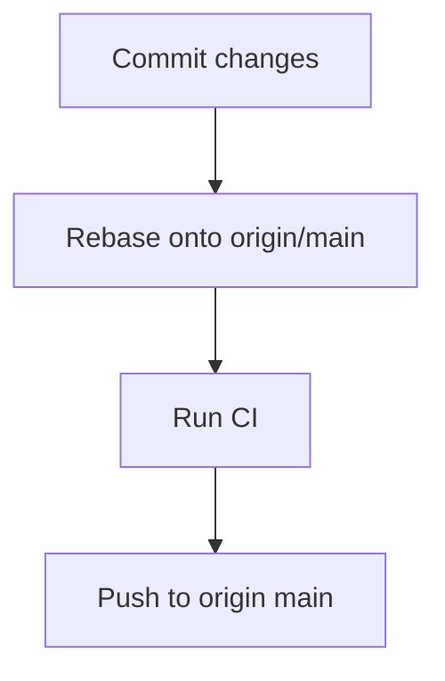

# Plan: Prep and Push to GitHub

> **Phase:** implement (approved)
> **Updated:** 2026-06-01

## Objectives

1. Clean working tree — commit/stage all changes
2. Rebase onto origin/main — resolve conflicts
3. Run CI — ensure all checks pass
4. Push to origin main — safe push

## Task Sequence

## Key Details

- Safe push only — no `--force`
- CI: `./scripts/ci.sh --quick` (skips frontend build)
- Pre-push hook runs CI automatically; use `-o no-ci` if needed
