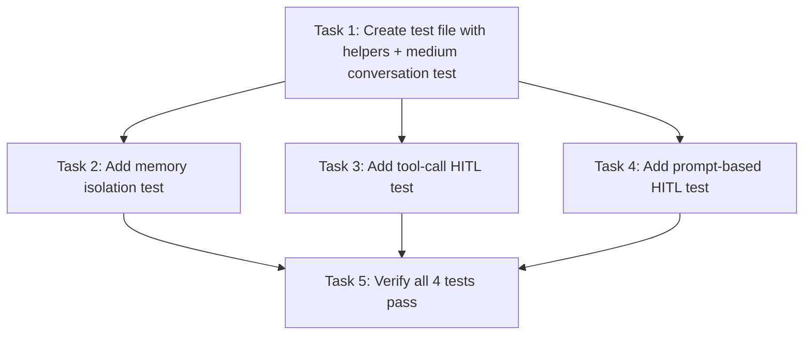

# Plan: Multi-Chat HITL & Memory Isolation Test

> **Phase:** implement (tasks approved)
> **Updated:** 2026-05-31

## Objectives

1. Test Owlynn medium-length conversation via built-in browser multi-chat (20+ turns, AC-1)
2. Verify memory isolation across separate chat sessions (history JSON + audit log, AC-2, AC-6)
3. Verify tool-call HITL (security_approval) triggers correctly and stays scoped (AC-3, AC-5)
4. Verify prompt-based HITL (scope_clarification) triggers correctly and stays scoped (AC-4, AC-5)

## Task Sequence

## Test File

- `tests/test_multi_chat_hitl_e2e.py` — single file, @pytest.mark.network
- Extends existing Playwright harness patterns
- No product code changes

## Key Implementation Details

- Playwright selectors based on CSS classes: `.hitl-prompt-card.hitl-pending`, `.hitl-btn-approve`, `.hitl-btn-decline`, `.hitl-choice-btn`
- HITL triggers: sensitive tool ("create a file named X") → security_approval; underspecified build request → scope_clarification
- Memory isolation: sentinel strings in chat A → assert absent in chat B history JSON
- Audit log: read `~/.owlynn/logs/audit.jsonl` → filter by thread_id

## Dependencies

- Backend running on port 8000
- Playwright browser runtime installed
- Qdrant + Redis (from project docker-compose) if needed for full conversation flow
