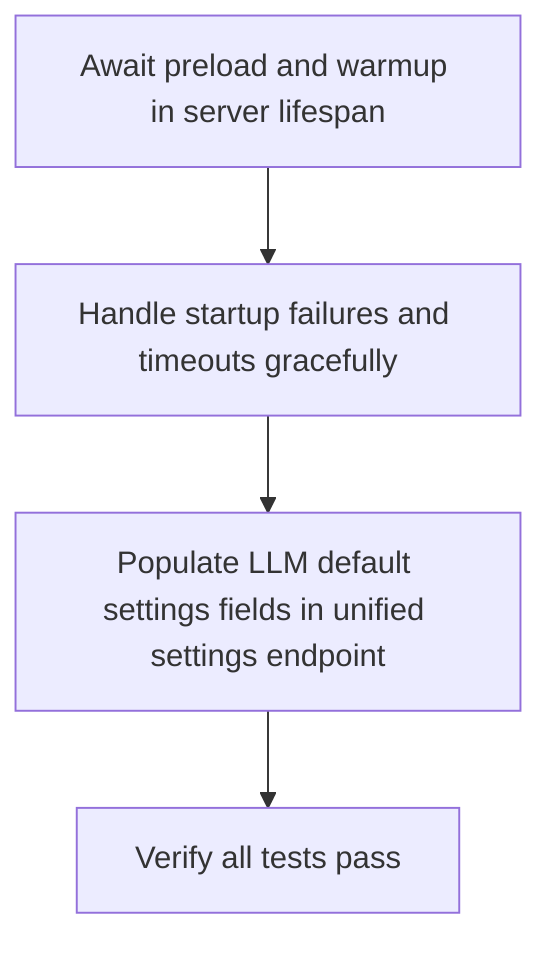

# Plan: Startup Race Fix & Settings Consolidation

> **Phase:** requirements
> **Updated:** 2026-06-04

## Objectives

1. Await LLM preloading and warmup before completing FastAPI startup lifespan, eliminating client race conditions.
2. Gracefully handle preloading and warmup failures/timeouts to ensure the server starts up successfully even if LM Studio is offline.
3. Populate missing LLM default settings fields in the `/api/unified-settings` REST endpoint from centralized configuration defaults.
4. Pass 100% of the unit and integration tests.

## Task Sequence

## Key Details

- We block the FastAPI startup lifespan using `await` on the preloading coroutine instead of spawning a background task.
- We resolve defaults from `defaults.yaml` via `config_loader` if not explicitly defined in the user profile.
