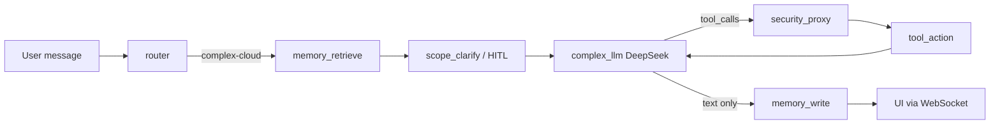

# Changelog: Web Search Synthesis Fix (DeepSeek / GAMMA vs ZONA)

> **Purpose:** Record the bugs found when web-search questions (e.g. *"what should I play anomaly modpack, GAMMA or ZONA"*) failed to produce a final answer, and the fixes applied in `complex.py`, WebSocket handler, and fallback utilities.

**Trigger question:** `what should I play anomaly modpack, GAMMA or ZONA`  
**Verified:** 2026-06-10 — automated browser run on `http://127.0.0.1:5173`, thread `thread-251bf73b-…`

## Symptom summary (what the user saw)

1. HITL approved web search, but **no final written answer** after many tool panels.
2. **Raw DSML markup** in chat: `<｜｜DSML｜｜tool_calls>…` instead of prose.
3. **Fallback dump** instead of a recommendation: *"I could not get a polished summary…"* plus raw page excerpts.
4. **Vietnamese medical "Zona"** hits (shingles) when the user meant the STALKER modpack **ZONA**.
5. **Local Qwen / embeddings** activity in LM Studio logs — looked like the answer path, but was post-turn memory/knowledge work.

## Architecture (expected path)



## Bugs and fixes

### BUG-WS-1 — Parallel tool results dropped (DeepSeek 400)

| | |
|---|---|
| **Severity** | Critical |
| **Symptom** | Turn 2+ returned HTTP 400: *"insufficient tool messages following tool_calls message"*; agent fell back to local Qwen. |
| **Root cause** | LangGraph `ToolNode` returns **only new** `ToolMessage`s. `complex_tool_action_node` sliced with `output_messages[len(current_messages):]`, which kept **one** result when lengths were unrelated — parallel `deep_research` + 2× `web_search` lost 2 of 3 replies. |
| **Fix** | `_extract_tool_output_delta()` detects tool-only vs full-history output and returns the full delta. |
| **Files** | `src/agent/nodes/complex.py` |
| **Tests** | `tests/test_tool_output_delta.py` |

---

### BUG-WS-2 — Infinite web tool loop (no synthesis turn)

| | |
|---|---|
| **Severity** | Critical |
| **Symptom** | 8+ `complex_llm` cycles in ~45s; every turn `content_len: 0`, `has_tool_calls: true`; never reached `memory_write`. |
| **Root cause** | Prompt encourages exhaustive search with no stop condition. Stripping only **web** tools left `ask_user` bound → `tools_bound: true` → `tool_choice: "auto"` → DeepSeek kept emitting tool calls. |
| **Fix** | 1. `complex.max_web_tool_rounds: 3` in `defaults.yaml`. 2. `_count_ai_tool_rounds()` sets `force_web_synthesis` when budget exhausted. 3. On forced synthesis, **`tools_for_invoke = None`** (drop **all** tools — DeepSeek-compliant way to force text). 4. Synthesis prompt forbids further web tools and DSML. |
| **Files** | `src/agent/nodes/complex.py`, `src/config/defaults.yaml` |
| **Config** | `complex.max_web_tool_rounds: 3` |

---

### BUG-WS-3 — DSML pseudo-tool calls in assistant content

| | |
|---|---|
| **Severity** | High |
| **Symptom** | UI showed `<｜｜DSML｜｜tool_calls>…fetch_webpage…` in assistant bubbles; blank after strip triggered wrong fallback. |
| **Root cause** | DeepSeek V4 sometimes puts tool invocations in `content` (DSML markup) instead of structured `tool_calls`, especially when tools are unbound on synthesis turns. Fetch-retry nudges on the last tool round encouraged more pseudo-calls. |
| **Fix** | 1. `_content_has_dsml_tool_syntax()` / `_strip_dsml_blocks()` in `formatter.py`. 2. Always sanitize content when DSML present (including `has_tool_calls: true`). 3. `skip_pre_synthesis_nudges` on final tool round. 4. `_sanitize_assistant_text()` in WebSocket handler for stream + final messages. 5. Cloud **synthesis retry** (second invoke, `tools=None`) when forced synthesis returns DSML/short text. |
| **Files** | `src/agent/nodes/complex_utils/formatter.py`, `src/agent/nodes/complex_utils/cloud_payload.py`, `src/agent/nodes/complex.py`, `src/api/ws/handler.py` |
| **Tests** | `tests/test_dsml_formatter.py` |

---

### BUG-WS-4 — Blank synthesis → raw excerpt / search dump

| | |
|---|---|
| **Severity** | High |
| **Symptom** | Final message: *"I could not get a polished summary from the cloud model…"* or numbered list of URLs/snippets — not a GAMMA vs ZONA recommendation. |
| **Root cause** | After DSML strip, `cleaned_len: 0` → `_fallback_for_blank_response()` preferred raw `web_search` payloads. |
| **Fix** | 1. Cloud synthesis retry (see BUG-WS-3). 2. **Local medium LLM synthesis** if cloud retry still fails (`medium-default-synthesis`). 3. Rewrote `fallback.py`: prefer `fetch_webpage` / `deep_research` excerpts; `_web_search_content_relevant()` filters medical-Zona hits for gaming/modpack queries. |
| **Files** | `src/agent/nodes/complex_utils/fallback.py`, `src/agent/nodes/complex.py` |

---

### BUG-WS-5 — Ambiguous "ZONA" → Vietnamese medical results

| | |
|---|---|
| **Severity** | Medium |
| **Symptom** | Qwen embedding log indexed *"Zona thần kinh"*, *"BỆNH ZONA"*; fallback surfaced irrelevant medical pages. |
| **Root cause** | Bare token **ZONA** matches shingles (Vietnamese *zona thần kinh*) in search indexes; fallback did not filter by user intent. |
| **Fix** | `_user_expects_gaming_context()` + `_web_search_content_relevant()` in `fallback.py`; gaming queries require STALKER/modpack signals and reject dominant medical markers. |
| **Files** | `src/agent/nodes/complex_utils/fallback.py` |

---

### BUG-WS-6 — Misread: local LLM "answering" the question

| | |
|---|---|
| **Severity** | Informational (not a bug) |
| **Symptom** | MiniCPM + Qwen visible in LM Studio during/after the turn. |
| **Explanation** | **Answer path:** `complex_llm` → `large-cloud` (DeepSeek). **Post-turn:** MiniCPM (router/title), Qwen (memory extraction, knowledge-cache embeddings). Local synthesis runs **only** if cloud synthesis retry fails. |
| **Evidence** | Debug log: tool rounds `model_label: large-cloud`; synthesis line `synthesis_retry: true`. |

## Verification (2026-06-10)

Automated browser reproduction:

| Check | Result |
|-------|--------|
| Route after HITL | `complex-cloud`, `toolbox: ["web_search"]` |
| Tool rounds | 3 × `large-cloud` with `has_tool_calls: true` |
| Forced synthesis | `force_web_synthesis: true`, `tools_for_invoke: None` |
| Cloud retry | `synthesis_retry: true`, `final_len: 4323` |
| Graph completion | `complex_llm → memory_write` |
| UI final answer | Full GAMMA vs ZONA comparison; recommends **ZONA first** |
| Vietnamese medical hits | None in final answer |
| Cloud cost | ~5 calls, ~$0.002 (flash) |

Debug log path (session instrumentation): `.cursor/debug-51fe1b.log`

Example synthesis log line:

```json
{"force_web_synthesis": true, "synthesis_retry": true, "final_len": 4323, "has_tool_calls": false, "model_label": "large-cloud"}
```

## Known limitations (open / cosmetic)

| ID | Issue | Notes |
|----|-------|-------|
| L-1 | DSML fragment in **intermediate** tool-turn bubble | Final answer is clean; likely pre-sanitized message stored in thread history. |
| L-2 | Local synthesis nudge mentions "GAMMA vs ZONA" literally | Should be generalized to any comparison question (`complex.py` ~1295). |
| L-3 | Debug instrumentation still in `complex.py` | `#region agent log` → `.cursor/debug-51fe1b.log`; remove after sign-off. |

## Files changed (complete list)

| File | Role |
|------|------|
| `src/agent/nodes/complex.py` | Tool delta, round cap, forced synthesis, DSML sanitize, cloud/local retry |
| `src/agent/nodes/complex_utils/formatter.py` | DSML detect/strip helpers |
| `src/agent/nodes/complex_utils/fallback.py` | Relevance filter, fetch-first fallback |
| `src/agent/nodes/complex_utils/cloud_payload.py` | `finalize_cloud_visible_content` uses DSML strip |
| `src/api/ws/handler.py` | `_sanitize_assistant_text` on stream and final UI text |
| `src/config/defaults.yaml` | `complex.max_web_tool_rounds: 3` |
| `tests/test_tool_output_delta.py` | Parallel tool delta tests |
| `tests/test_dsml_formatter.py` | DSML strip tests |

## Related

- [`docs/WEB_SEARCH.md`](../../WEB_SEARCH.md) — web tool behavior
- [`docs/HITL.md`](../../HITL.md) — router HITL / scope clarify
- [`docs/CLOUD-LLM-ARCHITECTURE.md`](../../CLOUD-LLM-ARCHITECTURE.md) — DeepSeek path
- [`docs/debugging/agent-graph.md`](../../debugging/agent-graph.md) — graph debugging
- [`docs/BUG-TRACKER.md`](../../BUG-TRACKER.md) — BUG-13 entry

## Last updated

2026-06-10 — web-search-synthesis-fix; verified via browser automation
