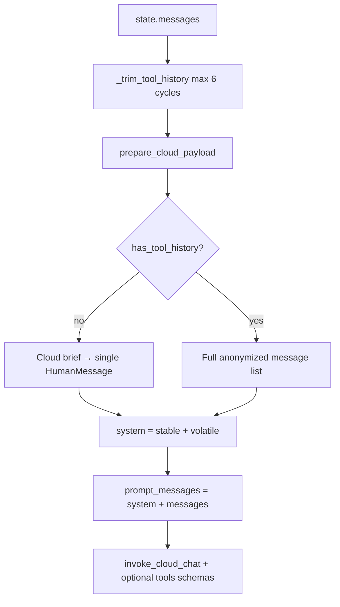

# Cloud Multi-Turn Context — What Owlynn Sends to DeepSeek

> **Purpose:** Explain how conversation history and tools are assembled when a user sends a second (or later) message on a `complex-cloud` thread, and how that design interacts with DeepSeek V4 **KV prefix cache** billing.

## When this applies

- Route: **`complex-cloud`** → DeepSeek V4 (`large-cloud`)
- Node: `complex_llm` in [`src/agent/nodes/complex.py`](../../src/agent/nodes/complex.py)
- Payload prep: [`prepare_cloud_payload()`](../../src/agent/nodes/complex_utils/cloud_payload.py)

Local fallback (`complex-default` / Qwen) uses a different path (LM Studio fold) and is not covered here.

---

## Message accumulation

LangGraph stores the full thread in `state["messages"]` (Redis checkpointer). After one completed turn with web tools, the list typically looks like:

```
HumanMessage("prompt 1")
AIMessage(content="", tool_calls=[web_search, ...])
ToolMessage(name="web_search", ...)
ToolMessage(name="fetch_webpage", ...)   # optional
AIMessage("answer to prompt 1")
HumanMessage("prompt 2")                 # user sends again
```

Each user message **appends**; nothing is dropped unless summarization or tool trimming runs (see below).

---

## Building the next DeepSeek request



### 1. System prompt (every turn)

One `role: system` message:

| Layer | Content | Changes per turn? |
|-------|---------|-------------------|
| **Stable** | `COMPLEX_PROMPT_STABLE` — identity, behaviors, guidelines | Rarely (code deploy) |
| **Volatile** | Date/time, memory, knowledge cache, persona, HITL/security notices | **Often** (memory write, new turn) |
| **Tool guidance** | Web / no-web / vision instructions | Per mode |

Stable is intentionally placed **first** so an unchanged prefix can benefit from KV cache hits even when volatile text changes (see [Cache compliance](#deepseek-kv-prefix-cache-compliance)).

### 2. Conversation body — two modes

Controlled by [`has_tool_history()`](../../src/agent/nodes/complex_utils/cloud_payload.py):

#### Mode A — No tool history (simple prior turn)

If the thread has **no** `ToolMessage` and **no** `AIMessage.tool_calls`:

- **`cloud_brief`** replaces the chat body with one anonymized `HumanMessage` ([`cloud_brief.py`](../../src/agent/hitl/cloud_brief.py)).
- Brief includes:
  - **Current user request** — latest `HumanMessage` text (prompt 2)
  - **Prior assistant context** — first ~300 chars of the last assistant reply
  - Scope, compressed memory/knowledge, toolbox hints

DeepSeek does **not** receive verbatim prompt 1 + full answer 1.

#### Mode B — Tool history exists

If any prior turn used tools (web search, fetch, shell, etc.):

- **Full** `trimmed_messages` are sent (anonymized): all users, assistants, tool calls, and tool results.
- Required for:
  - DeepSeek **tool-loop** API rules (`tool_call_id` ↔ `ToolMessage` pairing)
  - **Thinking mode** — must replay `reasoning_content` on assistant messages with `tool_calls` ([DEEPSEEK_V4_INTEGRATION.md](../architecture/DEEPSEEK_V4_INTEGRATION.md) §4)

### 3. History trimming

[`_trim_tool_history()`](../../src/agent/nodes/complex.py) (default **6** tool cycles):

- Keeps the **last 6** full tool cycles (AI `tool_calls` + `ToolMessage` pairs).
- Older tool outputs become one-line summaries: `[web_search: completed, 4521 chars output]`.
- Short threads (≤6 messages or ≤6 tool cycles) pass through unchanged.

### 4. Auto-summarize (long threads)

If `active_tokens > 85%` of `context_window`, [`auto_summarize`](../../src/agent/nodes/summarize.py) may replace **older** messages with a summary **before** the next router/complex turn. That rewrites prefix history and reduces cache match on those tokens.

---

## Tools: schemas vs results

| What | Where in API request | When |
|------|----------------------|------|
| **Tool definitions** (JSON schemas) | `tools` + `tool_choice: auto` | Each `complex_llm` invoke while tools are bound |
| **Tool results** | `messages[]` with `role: tool` | Prior turns stay in history (Mode B) |
| **Tool execution** | Local `tool_action` node | Never sent as schemas — only outputs as `ToolMessage` |

[`_resolve_complex_tools()`](../../src/agent/nodes/complex.py) rebuilds the allowed tool list each turn; tools used earlier in the thread are re-included.

**Per-turn web cap:** `complex.max_web_tool_rounds: 3` — after three assistant tool-calling rounds, the next invoke sets `tools=None` and forces a text-only synthesis answer.

---

## Worked examples

### Example 1 — Two plain questions (no tools on turn 1)

1. User: “What is 2+2?” → Assistant: “4”
2. User: “What about 3+3?”

**Sent to DeepSeek:**

```
system: [stable core + volatile session context + tool guidance]
user:   [CLOUD BRIEF — task: "What about 3+3?", prior_context: "4", ...]
tools:  [schemas if mode != tools_off]
```

### Example 2 — Turn 1 used web search; turn 2 is a follow-up

1. User asks → `web_search` / `fetch_webpage` → assistant answers
2. User: “Which would you pick for a beginner?”

**Sent to DeepSeek:**

```
system: [stable + volatile + guidance]
user:    [prompt 1]
assistant: [tool_calls + optional prose; reasoning_content if thinking on]
tool:      [search/fetch payloads...]
assistant: [final answer 1]
user:      [prompt 2]
tools:     [schemas]
```

---

## DeepSeek KV prefix cache compliance

### How DeepSeek caching works

From [DeepSeek context caching docs](https://api-docs.deepseek.com/guides/kv_cache):

- **Automatic** — no `cache_control` breakpoints.
- Cache hits require an **identical token prefix from position 0** on subsequent requests.
- Billing: `prompt_cache_hit_tokens` (~10× cheaper input) vs `prompt_cache_miss_tokens`.
- Optional `user` request field isolates cache buckets per logical user/conversation.

Owlynn tracks hits in [`SessionCostTracker`](../../src/agent/cloud_cost_tracker.py) and surfaces them in `model_info.token_usage` and the cloud usage chip.

### What Owlynn does to **align** with cache hits

| Design choice | Cache effect |
|---------------|--------------|
| **`COMPLEX_PROMPT_STABLE` first** in system message | Stable tokens at start of prompt; still hit when volatile suffix changes |
| **Volatile suffix separate** (date, memory, persona) | Only volatile portion is a miss; stable prefix can still hit |
| **Full history on tool threads** (Mode B) | Turn 2+ appends new user message; prior messages unchanged → **strong prefix reuse** on tool-heavy chats |
| **`thread_id` → API `user`** | Per-thread cache isolation ([`complex.py` `_invoke_cloud_path`](../../src/agent/nodes/complex.py)) |
| **`reasoning_content` preserved** on tool-loop replay | API-compliant; keeps assistant message bytes stable for replay |
| **Network test** | [`tests/test_deepseek_cache_network.py`](../../tests/test_deepseek_cache_network.py) asserts `prompt_cache_hit_tokens > 0` on repeated identical prefix |

### What **reduces or breaks** prefix cache hits

| Behavior | Why |
|----------|-----|
| **Cloud brief (Mode A)** on follow-up turns | Replaces entire conversation with a **new** brief string — prior user/assistant tokens not replayed |
| **Volatile system changes** (date, memory, knowledge after `memory_write`) | Alters system message after stable prefix — miss from first changed token in system block |
| **`invalidate_brief_cache()`** after memory write | Next brief rebuild differs |
| **`_trim_tool_history`** summarizing old tools | Changes content of early tool messages |
| **`auto_summarize`** | Replaces old messages with summary text |
| **Anonymization placeholder drift** | If mappings change, message text can differ |
| **Different `tools` schemas** bound | Does not change `messages` prefix directly, but tool-loop turns often coincide with growing history |
| **Forced synthesis** (`tools=None`) | Same messages; only tools param removed — messages prefix can still hit |

### Compliance summary

| Question | Answer |
|----------|--------|
| Does Owlynn **support** DeepSeek cache telemetry? | **Yes** — reads and aggregates `prompt_cache_hit_tokens` / `prompt_cache_miss_tokens`. |
| Is the payload **structured for cache-friendly prefixes**? | **Partially by design** — stable/volatile split + full history on tool loops. |
| Does every turn get **100% cache hit**? | **No** — volatile context, cloud brief mode, trimming, and summarization intentionally change prefixes. |
| Is Owlynn **API-compliant** for tool + thinking loops? | **Yes** — `reasoning_content` replay via [`message_to_deepseek_dict()`](../../src/agent/nodes/complex_utils/cloud_payload.py) (required to avoid 400s; also preserves loop structure for cache). |

**Practical expectation:**

- **Tool-heavy threads** (web research): best cache reuse — history is append-only and brief mode is skipped.
- **Plain Q&A threads** (brief mode): cheaper input via brief compression, but **less** multi-turn prefix reuse on the conversation body; stable system prefix may still hit.
- UI **cache %** on the cloud chip reflects session aggregates, not a guarantee of per-turn hits.

---

## What is not sent to DeepSeek

- Raw workspace file bytes (unless inlined into a user message locally)
- Images as multimodal input (Florence vision proxy → text first)
- Unanonymized PII when `cloud_anonymization_enabled` is on
- Local tool execution logic — only schemas + past `ToolMessage` text

---

## Related

- [`docs/architecture/DEEPSEEK_V4_INTEGRATION.md`](../architecture/DEEPSEEK_V4_INTEGRATION.md) — thinking mode, tool loops, cache pricing
- [`docs/CLOUD-LLM-ARCHITECTURE.md`](../CLOUD-LLM-ARCHITECTURE.md) — payload path overview
- [`docs/changes/cloud-usage-context-chip/CHANGELOG.md`](../changes/cloud-usage-context-chip/CHANGELOG.md) — session cost + context breakdown UI
- [`docs/changes/web-search-synthesis-fix/CHANGELOG.md`](../changes/web-search-synthesis-fix/CHANGELOG.md) — web tool round caps

## Last updated

2026-06-10 — initial guide: multi-turn payload + KV cache compliance
