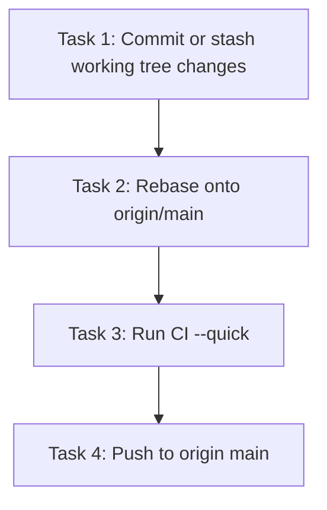

# Tasks: Prep and Push to GitHub

> **Purpose:** Implementation plan broken into checkable tasks.

## Task Sequence

---

### Task 1: Commit or stash working tree changes

- **Depends on:** none
- **Maps to:** AC-1, AC-3
- **Description:** Stage and commit all tracked-file modifications and relevant untracked files, or stash them, so working tree is clean for rebase.

#### verify_steps

- [ ] `cd /Users/tim/Works/OwlynnV2 && git status --porcelain` — expected: no output (clean working tree)

---

### Task 2: Rebase onto origin/main

- **Depends on:** Task 1
- **Maps to:** AC-1
- **Description:** `git fetch origin && git rebase origin/main` — resolve any conflicts that arise.

#### verify_steps

- [ ] `cd /Users/tim/Works/OwlynnV2 && git log --oneline origin/main..HEAD` — expected: shows commits ahead of remote

---

### Task 3: Run CI

- **Depends on:** Task 2
- **Maps to:** AC-2
- **Description:** Run `./scripts/ci.sh --quick` and confirm exit 0.

#### verify_steps

- [ ] `cd /Users/tim/Works/OwlynnV2 && ./scripts/ci.sh --quick` — expected: exit 0

---

### Task 4: Push to origin main

- **Depends on:** Task 3
- **Maps to:** AC-3
- **Description:** `git push origin main` — safe push, no force flag.

#### verify_steps

- [ ] `cd /Users/tim/Works/OwlynnV2 && git push origin main 2>&1` — expected: exit 0, no "rejected" or "non-fast-forward" in output

---

## Verification Checklist

| AC ID | Met By Tasks |
|-------|-------------|
| AC-1 | Task 1, Task 2 |
| AC-2 | Task 3 |
| AC-3 | Task 4 |

## Approval

- `tasks-review` AskQuestion: **approved** (2026-06-01)
