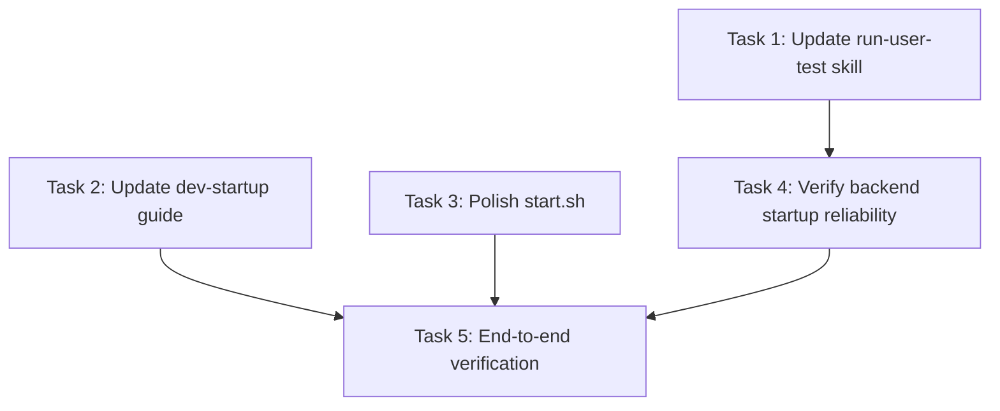

# Tasks: Browser-Only Startup

> **Purpose:** Implementation plan broken into checkable tasks.
>
> **plan_ref:** `.cursorplan/active/browser-only-startup/plan.md`

## Task Sequence

---

### Task 1: Update `run-user-test.mdc` for browser-only launch

- **Depends on:** none
- **Maps to:** AC-1, AC-4
- **Files:**
  - `.cursor/rules/run-user-test.mdc` — replace Tauri launch with browser-only Vite launch; use `block_until_ms: 0` for backend startup
- **Description:** Rewrite the agent skill to launch the browser dev server (Vite on 5173) instead of Tauri. Replace the `&` backend start with `block_until_ms: 0` pattern. Add a note that Tauri desktop app development is paused. Keep container/LM Studio checks.

#### verify_steps

- [ ] `head -5 .cursor/rules/run-user-test.mdc` — contains "browser" or "Vite", does NOT contain "tauri dev"
- [ ] `rg "block_until_ms" .cursor/rules/run-user-test.mdc` — finds the persistent background pattern
- [ ] `rg "paused|Paused" .cursor/rules/run-user-test.mdc` — finds paused notice for Tauri

---

### Task 2: Update `dev-startup.md` — mark Tauri as paused

- **Depends on:** none
- **Maps to:** AC-3
- **Files:**
  - `docs/guides/dev-startup.md` — add paused notice, simplify architecture diagram, mark Tauri troubleshooting as paused
- **Description:** Add a clear "Tauri (Paused)" section explaining that browser-only development at `http://127.0.0.1:5173` is the current mode. Keep Tauri references but explicitly mark them as paused. Simplify the architecture diagram to show browser-only path.

#### verify_steps

- [ ] `rg -i "paused" docs/guides/dev-startup.md` — finds at least one paused notice
- [ ] `rg -i "tauri" docs/guides/dev-startup.md` — Tauri references still exist but are marked paused
- [ ] `rg "browser-only\|browser.first" docs/guides/dev-startup.md` — browser-only language present

---

### Task 3: Polish `start.sh` — consistency fixes

- **Depends on:** none
- **Maps to:** AC-2
- **Files:**
  - `start.sh` — minor comment/header polish, verify all steps work
- **Description:** Update shebang comment from "browser-first" to "browser-only" for consistency. Verify the script runs correctly end-to-end (containers, backend, frontend). No functional changes needed — the script already works.

#### verify_steps

- [ ] `bash -n start.sh` — no syntax errors
- [ ] `rg "browser-only" start.sh` — header comment reflects browser-only
- [ ] `./start.sh` starts and exits cleanly (Ctrl+C to stop) — backend on 8000, frontend on 5173 both respond

---

### Task 4: Verify backend startup reliability

- **Depends on:** Task 1
- **Maps to:** AC-4
- **Files:**
  - None (verification-only task)
- **Description:** After Task 1 updates the skill with the `block_until_ms: 0` pattern, verify that starting the backend via Shell tool keeps it alive. Confirm the process persists for >30 seconds and responds to health checks. Document the working invocation in CHANGELOG.

#### verify_steps

- [ ] Start backend via `Shell(block_until_ms=0, command="cd ... && PYTHONPATH=... uvicorn ...")` — process lives >30s
- [ ] `curl -s http://127.0.0.1:8000/api/health` returns 200 while backend is running
- [ ] `lsof -iTCP:8000 -sTCP:LISTEN` shows the uvicorn process listening

---

### Task 5: End-to-end browser-only startup verification

- **Depends on:** Task 2, Task 3, Task 4
- **Maps to:** AC-1, AC-2, AC-5
- **Files:**
  - None (verification-only task)
- **Description:** Run the complete browser-only startup flow: `start.sh` (or agent-equivalent steps) → verify browser loads at `http://127.0.0.1:5173` → verify API proxying works → verify no Tauri processes are running. Confirm the `run-user-test` skill produces the correct agent behavior.

#### verify_steps

- [ ] Run `start.sh` — all services start, browser opens at 5173
- [ ] `curl -s http://127.0.0.1:5173/api/health` — returns 200 (API proxy working)
- [ ] `pgrep -f "tauri"` — returns nothing (no Tauri process running)
- [ ] `lsof -iTCP:5173 -sTCP:LISTEN` — Vite dev server listening

---

## Verification Checklist (for feature-verify-review)

| AC ID | Met By Tasks |
|-------|-------------|
| AC-1 | Task 1, Task 5 |
| AC-2 | Task 3, Task 5 |
| AC-3 | Task 2 |
| AC-4 | Task 1, Task 4 |
| AC-5 | Task 5 |

## Approval

- `tasks-review` AskQuestion: approved (2026-06-01T19:22:00Z)
