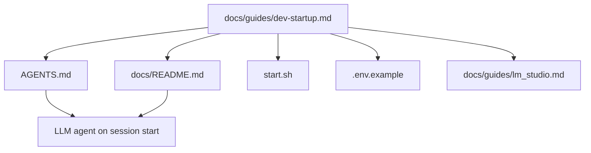

# Design: Dev Startup Guide

> **Purpose:** Define how the requirements will be implemented. Written in Plan mode after requirements are approved. Must be approved via AskQuestion `design-review` popup before proceeding to tasks.

## Architecture Overview

A single new documentation file `docs/guides/dev-startup.md` that is the authoritative startup reference. It cross-references existing docs (`lm_studio.md`, `quickstart.md`) rather than duplicating them, and it is discoverable via links from `AGENTS.md` and `docs/README.md`.

## System Diagram

## API / Interface Design

This is a documentation-only change. No API endpoints.

## Data Model

No data model changes. New file:

| Entity | Fields | Relations |
|--------|--------|-----------|
| `docs/guides/dev-startup.md` | Title, YAML frontmatter, sections (Prerequisites, Env Config, Step-by-Step Launch, Troubleshooting) | References `start.sh`, `.env.example`, `docs/guides/lm_studio.md` |

## Component / Module Breakdown

| Component | Responsibility | Files |
|-----------|---------------|-------|
| Startup guide | Authoritative startup documentation with prerequisites, env setup, launch steps, and per-layer troubleshooting | `docs/guides/dev-startup.md` (new) |
| Agent entrypoint link | Ensure `AGENTS.md` "Quick start" section links to the startup guide | `AGENTS.md` (edit) |
| Docs map link | Ensure `docs/README.md` reading order references the startup guide | `docs/README.md` (edit) |

## Error Handling Strategy

N/A — documentation-only change.

## Security Considerations

N/A — no code changes.

## Trade-offs and Decisions

| Decision | Rationale | Alternatives Considered |
|----------|-----------|------------------------|
| New file vs extending `quickstart.md` | `quickstart.md` focuses on chat UX features (highlighting, tool cards, mobile). A dedicated startup file prevents scope creep and keeps each doc focused. | Extend `quickstart.md` — rejected because it mixes runtime UX with dev setup concerns |
| Reference vs duplicate `lm_studio.md` | `lm_studio.md` already covers model loading. Cross-referencing avoids drift between docs. | Duplicate LM Studio steps — rejected (maintenance burden) |
| Link from both AGENTS.md and docs/README.md | Double linkage maximizes discoverability for both human devs and LLM agents. | Single link — rejected (agents may only read one entrypoint) |

## Open Questions

- [x] Should the guide include Tauri desktop launch? → No, browser-first dev flow per Out of Scope.
- [x] Should it duplicate container details from `docker-compose.yml`? → No, reference the file and list the three backends `start.sh` tries.
- [x] Where exactly in AGENTS.md and docs/README.md should the link go? → In the numbered reading order steps (step 1 for AGENTS.md, step 2 for docs/README.md).

## References

- `requirements.md` — acceptance criteria to satisfy
- `plan_ref: .cursorplan/active/dev-startup-guide/plan.md`

## Approval

- `design-review` AskQuestion: approved ✅
