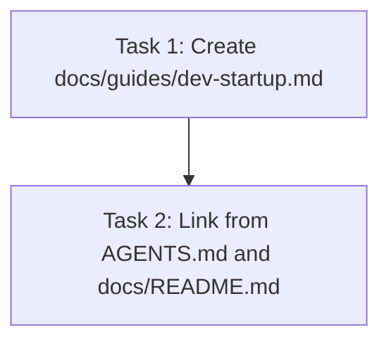

# Tasks: Dev Startup Guide

> **Purpose:** Implementation plan broken into checkable tasks. Written in Plan mode after design is approved. Must be approved via AskQuestion `tasks-review` popup before implementation.
>
> **plan_ref:** `.cursorplan/active/dev-startup-guide/plan.md`

## Task Sequence

---

### Task 1: Create the startup guide document

- **Depends on:** none
- **Maps to:** AC-1, AC-2, AC-3, AC-4, AC-5, AC-6
- **Files:**
  - `docs/guides/dev-startup.md` — new file: authoritative startup guide with prerequisites, env setup, step-by-step launch, and per-layer troubleshooting
- **Description:** Write a complete `docs/guides/dev-startup.md` covering: (1) prerequisite check with install commands for macOS, (2) `.env` setup from `.env.example`, (3) container layer (Qdrant+Redis), (4) LM Studio setup cross-reference, (5) Python venv + deps, (6) frontend npm install, (7) `./start.sh` launch, (8) per-layer troubleshooting table.

#### verify_steps

- [ ] `ls docs/guides/dev-startup.md` — expected: file exists
- [ ] `grep -q "start.sh" docs/guides/dev-startup.md && echo "PASS"` — expected: PASS
- [ ] `grep -q "AGENTS.md" docs/guides/dev-startup.md && echo "PASS"` — expected: PASS (cross-references entrypoint)

---

### Task 2: Link startup guide from AGENTS.md and docs/README.md

- **Depends on:** Task 1
- **Maps to:** AC-7
- **Files:**
  - `AGENTS.md` — add startup guide to "Quick start" reading list
  - `docs/README.md` — add startup guide to reading order
- **Description:** Add the startup guide as a discoverable step in both key entrypoints so LLM agents and human devs find it without scanning the full codebase.

#### verify_steps

- [ ] `grep -q "startup" AGENTS.md && echo "PASS"` — expected: PASS
- [ ] `grep -q "startup" docs/README.md && echo "PASS"` — expected: PASS

---

## Verification Checklist (for feature-verify-review)

| AC ID | Met By Tasks |
|-------|-------------|
| AC-1 | Task 1 |
| AC-2 | Task 1 |
| AC-3 | Task 1 |
| AC-4 | Task 1 |
| AC-5 | Task 1 |
| AC-6 | Task 1 |
| AC-7 | Task 2 |

## Approval

- `tasks-review` AskQuestion: approved ✅
