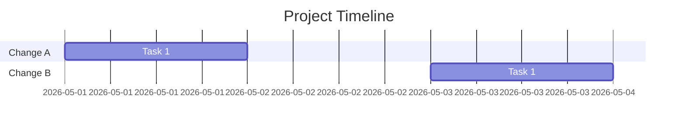

# Design: docs-standards-timeline

> **Purpose:** Define how the requirements will be implemented. Written in Plan mode after requirements are approved. Must be approved via AskQuestion `design-review` popup before proceeding to tasks.

## Architecture Overview

Two-layer approach: **(1)** Define a YAML frontmatter schema + standardized template structure, codified in `docs/standards/documentation.md`. **(2)** Apply it across all ~80 docs in batches, fixing doc–code sync errors (AC-8–14) during the pass. Generate a unified timeline doc aggregating all `docs/changes/*/CHANGELOG.md`.

## Frontmatter Schema

Every doc gets this YAML frontmatter between `---` delimiters:

```yaml
---
status: active | archived | draft | obsolete
category: architecture | reference | guide | changelog | debugging | planning | standards | audit | archive
last_updated: YYYY-MM-DD
owner: ai-agent | human
---
```

**Field semantics:**

| Field | Values | Description |
|-------|--------|-------------|
| `status` | `active`, `archived`, `draft`, `obsolete` | Whether the doc is current, historical, unfinished, or superseded |
| `category` | See above | Primary grouping for INDEX.md filtering |
| `last_updated` | ISO date | Date of last meaningful edit |
| `owner` | `ai-agent`, `human` | Who primarily maintains this doc |

## Template Structure

Every doc follows:

```
---
<frontmatter>
---
# <Title>

> **Purpose:** <1-2 sentence purpose>

<content>

## Related

- <link> — <description>

## Last updated

YYYY-MM-DD — <change-slug>
```

## Unified Timeline Design

**File:** `docs/PROJECT_TIMELINE.md`

Aggregates all entries from `docs/changes/*/CHANGELOG.md` into a single chronological table, sorted by date descending. Structure:

```yaml
---
status: active
category: changelog
last_updated: <generation date>
owner: ai-agent
---
```



Or a flat table:

| Date | Change | Task | Type | Summary |
|------|--------|------|------|---------|
| 2026-05-31 | docs-standards-timeline | T1 | docs | Add YAML frontmatter standard |

## Doc–Code Sync Fixes (AC-8 through AC-14)

| AC | Doc | Fix |
|----|-----|-----|
| AC-8 | `docs/CHAT_PROTOCOL.md` | Change `message` event type `"message"` → `"assistant.message"`. Remove ghost events `token_budget_update`, `cloud_budget_warning` (or mark as `*planned/not implemented*`) |
| AC-9 | `docs/STATUS.md` | Update bug table — set BUG-1..8 to `Fixed` status, update `last_verified` to current date, update Phase 8 to `Complete` |
| AC-10 | `docs/API_REFERENCE.md` | Add 13 missing endpoints: `/v1/chat/completions`, persona CRUD (`/api/persona`, `/api/personas`), `PUT /api/unified-settings`, `POST /api/chats/generate-title`, project knowledge endpoints, chat history, etc. |
| AC-11 | `docs/ARCHITECTURE_OVERVIEW.md` | Update mermaid graph to include `auto_summarize`, `scope_clarify`, `plan_review` nodes. Fix router→complex edge |
| AC-12 | `docs/AI_AGENT_INDEX.md` | Add Phase 8 to phase status. Add status column to bug table. Update `last_verified` |
| AC-13 | `docs/INDEX.md` | Option A: expand to all docs. Option B: change label to "SDD framework manifest" |
| AC-14 | `docs/TOOLS.md` | Add `search_workspace_docs` to memory toolbox section |

## Component / Module Breakdown

| Component | Responsibility | Files |
|-----------|---------------|-------|
| Frontmatter schema | Define YAML fields and values | `docs/standards/documentation.md`, `docs/STANDARDS.md` |
| Template standard | Codify doc structure rules | `docs/standards/documentation.md` |
| Doc audit pass | Apply frontmatter + template to all docs | Every file under `docs/` |
| Timeline generation | Aggregate CHANGELOGs into one view | `docs/PROJECT_TIMELINE.md` (new) |
| INDEX.md refresh | Full recursive manifest | `docs/INDEX.md` |
| README.md refresh | Reference new artifacts | `docs/README.md` |
| Sync fixes | Correct doc–code mismatches (AC-8..14) | 7 individual doc files |

## Task Batching Strategy

~80 docs → 4 batches to avoid context limits:

| Batch | Scope | Size | ACs |
|-------|-------|------|-----|
| **Batch A** | Update standard doc + Sync fixes (AC-8..14) | 7 docs | AC-8..14 |
| **Batch B** | Top-level docs/*.md frontmatter + template | ~20 docs | AC-1, AC-2, AC-7 |
| **Batch C** | Subfolder docs (debugging/, guides/, technical/, archive/) frontmatter + template | ~30 docs | AC-1, AC-2, AC-7 |
| **Batch D** | INDEX.md refresh + PROJECT_TIMELINE.md generation + README.md update | 3 docs | AC-3, AC-4 |

## Trade-offs and Decisions

| Decision | Rationale | Alternatives Considered |
|----------|-----------|------------------------|
| YAML frontmatter | Standard markdown, parseable by any YAML tool, visible in file previews | JSON metadata file per doc (more complex); embedded HTML comments (non-standard) |
| `PROJECT_TIMELINE.md` as flat table | Fastest for AI agent scanning | Mermaid Gantt (renders well but harder to maintain); SQLite DB (overkill) |
| 4 batch passes | Avoids context limits on ~80 docs | Single pass (would exceed 200K context); incremental commits per batch |
| Fix sync errors within same change | Prevents propagating stale docs under new standard | Separate change (would delay standard rollout) |

## Resolved Questions

- AC-13: expand INDEX.md to full manifest (Option A)
- Standard location: extend existing `docs/standards/documentation.md` (not a new file)

## References

- `requirements.md` — acceptance criteria to satisfy
- `docs/standards/documentation.md` — existing standard to extend
- `plan_ref: .cursorplan/active/docs-standards-timeline/plan.md`

## Approval

- `requirements-review` AskQuestion: approved 2026-05-31
- `design-review` AskQuestion: approved 2026-05-31
