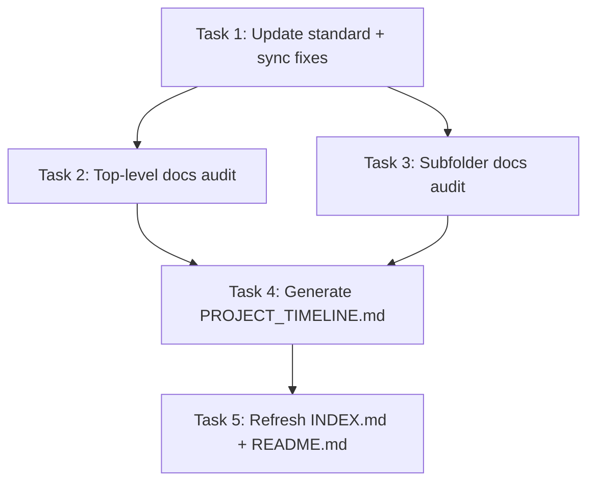

# Tasks: docs-standards-timeline

> **Purpose:** Implementation plan broken into checkable tasks. Written in Plan mode after design is approved. Must be approved via AskQuestion `tasks-review` popup before implementation.
>
> **plan_ref:** `.cursorplan/active/docs-standards-timeline/plan.md`

## Task Sequence

---

### Task 1: Update documentation standard + fix doc–code sync errors

- **Depends on:** none
- **Maps to:** AC-6, AC-8, AC-9, AC-10, AC-11, AC-12, AC-13, AC-14
- **Files:**
  - `docs/standards/documentation.md` — add YAML frontmatter schema, template rules, forbidden patterns, CHANGELOG format
  - `docs/CHAT_PROTOCOL.md` — fix `message` event type to `assistant.message`, remove/add ghost events
  - `docs/STATUS.md` — reconcile bug table (BUG-1..8 → Fixed), update `last_verified` to 2026-05-31, update Phase 8 status
  - `docs/API_REFERENCE.md` — add 13 missing endpoints (persona CRUD, /v1/chat/completions, project knowledge, etc.)
  - `docs/ARCHITECTURE_OVERVIEW.md` — update mermaid graph with `auto_summarize`, `scope_clarify`, `plan_review`
  - `docs/AI_AGENT_INDEX.md` — add Phase 8 to phase status, add status column to bug table, update `last_verified`
  - `docs/INDEX.md` — expand to list all docs with status + category + last_updated
  - `docs/TOOLS.md` — add `search_workspace_docs` to memory toolbox
- **Description:** First, extend `docs/standards/documentation.md` with the enhanced frontmatter schema and template rules. Then fix all 7 doc–code sync errors identified in the audit (AC-8 through AC-14), bringing each affected doc into sync with the actual codebase before applying the new standard.

#### verify_steps

- [ ] `rg '^---$' docs/standards/documentation.md | wc -l` — expected: `2` (frontmatter delimiters present)
- [ ] `rg 'event type:.*assistant\.message' docs/CHAT_PROTOCOL.md | wc -l` — expected: at least `1` (event type corrected)
- [ ] `rg 'BUG-1.*Crit' docs/STATUS.md | wc -l` — expected: bug table still present with accurate status
- [ ] `rg '/v1/chat/completions' docs/API_REFERENCE.md | wc -l` — expected: `1`
- [ ] `rg 'search_workspace_docs' docs/TOOLS.md | wc -l` — expected: `1`

---

### Task 2: Apply frontmatter + template to top-level docs

- **Depends on:** Task 1
- **Maps to:** AC-1, AC-2, AC-7
- **Files:**
  - All `docs/*.md` files (excluding subdirectories) — ~20 files
- **Description:** For each top-level doc under `docs/`, add YAML frontmatter with correct `status`, `category`, `last_updated`, and `owner`, then verify template compliance (purpose blockquote, `## Related`, `## Last updated`). Use the `docs/standards/documentation.md` as the canonical reference. Batch to avoid context limits.

#### verify_steps

- [ ] `rg '^---$' docs/*.md -l | wc -l` — expected: all top-level markdown files have frontmatter
- [ ] `rg '^## Last updated' docs/*.md -l | wc -l` — expected: all top-level markdown files have this section
- [ ] `rg '^## Related' docs/*.md -l | wc -l` — expected: all top-level markdown files have this section
- [ ] `rg '^> \*\*Purpose' docs/*.md -l | wc -l` — expected: all top-level markdown files have purpose blockquote

---

### Task 3: Apply frontmatter + template to subfolder docs

- **Depends on:** Task 1
- **Maps to:** AC-1, AC-2, AC-7
- **Files:**
  - `docs/debugging/*.md` — 7 files
  - `docs/guides/*.md` — 7 files
  - `docs/technical/*.md` — 1 file
  - `docs/archive/*.md` — 12 files (status: `archived`)
  - `docs/architecture/*.md` — 1 file
  - `docs/standards/*.md` — 2 files
  - `docs/examples/*.md` — 1 file
  - `docs/changes/*/CHANGELOG.md` — 2 files
- **Description:** Apply the same frontmatter + template treatment to all subfolder docs. Archives get `status: archived`. Batch by subfolder to manage agent context.

#### verify_steps

- [ ] `rg '^---$' docs/debugging/ -l | wc -l` — expected: all debugging docs have frontmatter
- [ ] `rg '^---$' docs/guides/ -l | wc -l` — expected: all guide docs have frontmatter
- [ ] `rg '^---$' docs/archive/ -l | wc -l` — expected: all archive docs have frontmatter
- [ ] `rg 'status: archived' docs/archive/ -l | wc -l` — expected: all archive docs have `archived` status

---

### Task 4: Generate unified timeline `docs/PROJECT_TIMELINE.md`

- **Depends on:** Task 2, Task 3
- **Maps to:** AC-3
- **Files:**
  - `docs/PROJECT_TIMELINE.md` — new file
  - `docs/changes/*/CHANGELOG.md` — source data
- **Description:** Create `docs/PROJECT_TIMELINE.md` with YAML frontmatter and a chronological table aggregating every entry from `docs/changes/*/CHANGELOG.md`. Sort by date descending. Include all task types (feature, fix, refactor, docs, test, chore). Use mermaid Gantt optionally. Add purpose blockquote and `## Related` / `## Last updated` sections.

#### verify_steps

- [ ] `head -5 docs/PROJECT_TIMELINE.md | head -1` — expected: `---` (frontmatter starts)
- [ ] `docs/PROJECT_TIMELINE.md` contains entries from all `docs/changes/*/CHANGELOG.md` files
- [ ] `rg '^## Last updated' docs/PROJECT_TIMELINE.md | wc -l` — expected: `1`

---

### Task 5: Refresh INDEX.md + README.md

- **Depends on:** Task 4
- **Maps to:** AC-4
- **Files:**
  - `docs/INDEX.md` — full recursive manifest with status, category, last_updated for every doc
  - `docs/README.md` — add reference to PROJECT_TIMELINE.md and expanded INDEX
- **Description:** Rewrite `docs/INDEX.md` to list every doc under `docs/` recursively with `status`, `category`, and `last_updated`. Update `docs/README.md` to reference `PROJECT_TIMELINE.md` in the reading order and structure section.

#### verify_steps

- [ ] `rg '^status:' docs/INDEX.md -c` — expected: each entry has status field
- [ ] `rg 'PROJECT_TIMELINE' docs/README.md | wc -l` — expected: at least `1`
- [ ] Docs count in INDEX.md matches actual `find docs -type f -name '*.md' | wc -l`

---

## Verification Checklist (for feature-verify-review)

| AC ID | Met By Tasks |
|-------|-------------|
| AC-1 | Task 2, Task 3 |
| AC-2 | Task 2, Task 3 |
| AC-3 | Task 4 |
| AC-4 | Task 5 |
| AC-5 | Task 3 (archive docs) |
| AC-6 | Task 1 |
| AC-7 | Task 2, Task 3 |
| AC-8 | Task 1 |
| AC-9 | Task 1 |
| AC-10 | Task 1 |
| AC-11 | Task 1 |
| AC-12 | Task 1 |
| AC-13 | Task 1 |
| AC-14 | Task 1 |

## Approval

- `requirements-review` AskQuestion: approved 2026-05-31
- `design-review` AskQuestion: approved 2026-05-31
- `tasks-review` AskQuestion: approved 2026-05-31
