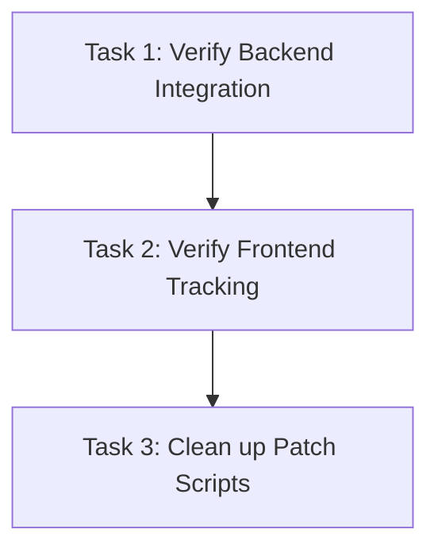

# Tasks: Fix One-Turn Lag (Message Correlation IDs)

> **Slug:** `fix-one-turn-lag`

## Task Sequence

---

### Task 1: Verify Backend Integration

- **Depends on:** none
- **Maps to:** AC-2
- **Files:**
  - `src/api/server.py`
- **Description:** Run existing WebSocket tests and manually verify that the `correlation_id` injection in `GraphSession._execute` and `_send_ws` is active and correct.

#### verify_steps
- [ ] `.venv/bin/pytest tests/test_websocket.py` (or similar WebSocket integration test script) — expected: passes, no regression.

---

### Task 2: Verify Frontend Tracking

- **Depends on:** Task 1
- **Maps to:** AC-1, AC-3, AC-4, AC-5
- **Files:**
  - `frontend-v2/src/App.tsx`
  - `frontend-v2/src/types/protocol.ts`
- **Description:** Run frontend tests (`npm run test`) to ensure the `pendingCorrelationId` logic compiles and works.

#### verify_steps
- [ ] `cd frontend-v2 && npm run test -- --run` — expected: vitest suite passes successfully.

---

### Task 3: Clean up Patch Scripts

- **Depends on:** Task 1, Task 2
- **Maps to:** AC-6
- **Files:**
  - `patch_server.py` (delete)
  - `patch_frontend.py` (delete)
  - `patch_types.py` (delete)
- **Description:** Remove the residual patch files used by the previous agent session to keep the repo clean.

#### verify_steps
- [ ] Ensure `patch_server.py` is removed.

---
## Approval

- `tasks-review` AskQuestion: approved (2026-06-04)
