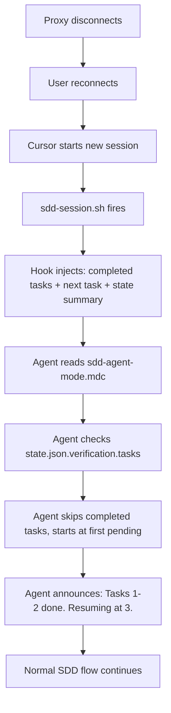

# Design: Fix Reconnect Task Progress Loss

> **Purpose:** Define how to prevent task progress loss after disconnect/reconnect. Three-layer defense: session hook context injection, rule-based auto-resume, and state.json task tracking. Must be approved via AskQuestion `design-review` popup before proceeding to tasks.

## Architecture Overview

When deepseek-cursor-proxy disconnects and the user reconnects, the Cursor agent starts a new session with no memory of prior conversation. The fix leverages the existing `state.json` (which persists on disk) and three mechanisms to re-establish context:

1. **sessionStart hook** (`sdd-session.sh`) injects completed task list + next pending task
2. **Agent rules** (`sdd-agent-mode.mdc`) instruct the agent to read state.json first and auto-skip completed tasks
3. **Core rules** (`sdd-core.mdc`) add a resume protocol so the agent announces what was already done

No new files are needed — only modifications to existing harness files.

## System Diagram



## Data Flow

### Before (current behavior)
```
Session start → agent knows nothing → reads tasks.md → starts at task 1
```

### After (fixed behavior)
```
Session start → sdd-session.sh reads state.json → injects completed tasks list
→ agent reads sdd-agent-mode.mdc → checks verification.tasks
→ skips tasks with "pass" → resumes at first "pending" task
→ announces: "Tasks 1-2 completed, resuming at task 3"
```

## Changes by Layer

### Layer 1: sdd-session.sh (hook)

Current behavior: injects phase + approvals + file paths.
New behavior: additionally injects completed task summary.

**New fields injected:**
```
## Task Progress
| Task | Status | Completed At |
|------|--------|-------------|
| 1    | pass   | 2026-05-31T04:00Z |
| 2    | pass   | 2026-05-31T04:05Z |
| 3    | —      | —            |

Next pending task: Task 3
```

This uses `state.json.verification.tasks` data already stored by the implement phase. The hook already parses state.json with jq — just adds a new section to the `additional_context` output.

### Layer 2: sdd-agent-mode.mdc (rules)

New section added before "Per-Task Protocol":

```
## Resume on Reconnect

Before implementing any task:

1. Read specs/active/<slug>/state.json
2. Check verification.tasks for completed tasks (status: "pass")
3. Skip all tasks where verification.tasks["{n}"].status === "pass"
4. Announce: "Tasks {completed} already done. Resuming at task {next}."
5. Start implementation from the first task without "pass" status
```

### Layer 3: sdd-core.mdc (rules)

Add to "Per-Task Protocol" section:

```
On session start: read state.json → announce completed tasks → resume at first pending task.
```

## Component / Module Breakdown

| Component | Responsibility | Files |
|-----------|---------------|-------|
| Session hook | Inject completed task context on reconnect | `.cursor/hooks/sdd-session.sh` |
| Agent rules | Instruct agent to skip completed tasks | `.cursor/rules/sdd-agent-mode.mdc` |
| Core rules | Add resume-on-reconnect protocol | `.cursor/rules/sdd-core.mdc` |
| State (existing) | Already tracks task completion | `specs/active/<slug>/state.json` |

## Error Handling Strategy

- **state.json missing:** Fall back to normal "no active change" behavior (already handled in hook)
- **state.json corrupt:** jq parse error → emit warning in context, fall back to normal start
- **verification.tasks empty:** Normal flow — start at task 1
- **Mixed pass/fail in tasks:** Skip "pass", resume at first non-pass task

## Security Considerations

- No new security surface — reads existing state.json only
- Session hook already runs in repo context with filesystem access

## Trade-offs and Decisions

| Decision | Rationale | Alternatives Considered |
|----------|-----------|------------------------|
| Trust state.json as source of truth | Already the canonical task status store; simplest | CHANGELOG-based detection (more complex, requires parsing markdown) |
| Inject context via additional_context | sessionStart hook design already supports this | additional_system_prompt (more aggressive, could confuse non-SDD sessions) |
| Modify existing files, no new files | Minimal surface area, easier to maintain | New dedicated resume hook (overkill for this scope) |
| No partial-task detection in v1 | Adds complexity; user can re-run task if unsure | CHANGELOG timestamp comparison (add later if needed) |

## Open Questions

- [x] Should we also inject CHANGELOG excerpts? → No for v1; state.json is sufficient and structured

## References

- `requirements.md` — acceptance criteria AC-1 through AC-5
- `plan_ref: .cursorplan/active/fix-reconnect-progress-loss/plan.md`
- [`.cursor/hooks/sdd-session.sh`](../../.cursor/hooks/sdd-session.sh) — current sessionStart hook
- [`.cursor/rules/sdd-agent-mode.mdc`](../../.cursor/rules/sdd-agent-mode.mdc) — current agent rules
- [`.cursor/rules/sdd-core.mdc`](../../.cursor/rules/sdd-core.mdc) — current core rules

## Approval

- `design-review` AskQuestion: **approved** 2026-05-31
