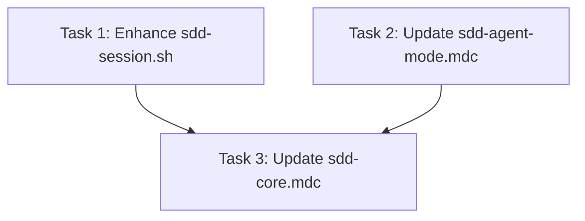

# Tasks: Fix Reconnect Task Progress Loss

> **Purpose:** Implementation plan broken into checkable tasks. Written in Plan mode after design is approved. Must be approved via AskQuestion `tasks-review` popup before implementation.
>
> **plan_ref:** `.cursorplan/active/fix-reconnect-progress-loss/plan.md`

## Task Sequence

Tasks 1 and 2 are independent. Task 3 is small and depends on both.

---

### Task 1: Enhance sdd-session.sh to inject task progress

- **Depends on:** none
- **Maps to:** AC-1, AC-4, AC-5
- **Files:**
  - `.cursor/hooks/sdd-session.sh` — add completed task summary to session start context
- **Description:** Modify the sessionStart hook to read `state.json.verification.tasks` and inject a table summarizing completed tasks and the next pending task number into the `additional_context` output.

#### verify_steps

- [ ] `bash -n .cursor/hooks/sdd-session.sh` — expected: exit 0 (valid bash syntax)
- [ ] Create a test state.json with tasks 1-2 marked "pass" and verify the hook output includes "Tasks 1-2 already completed" summary

---

### Task 2: Add resume-on-reconnect rules to sdd-agent-mode.mdc

- **Depends on:** none
- **Maps to:** AC-2, AC-3
- **Files:**
  - `.cursor/rules/sdd-agent-mode.mdc` — add "Resume on Reconnect" section before "Per-Task Protocol"
- **Description:** Add a rule section instructing the agent to check `state.json.verification.tasks` before implementing, skip completed tasks, and announce resumption.

#### verify_steps

- [ ] `grep -q "Resume on Reconnect" .cursor/rules/sdd-agent-mode.mdc` — expected: exit 0 (section exists)
- [ ] `grep -q 'verification.tasks' .cursor/rules/sdd-agent-mode.mdc` — expected: exit 0 (references state.json tasks)

---

### Task 3: Add resume protocol to sdd-core.mdc

- **Depends on:** Task 1, Task 2
- **Maps to:** AC-4
- **Files:**
  - `.cursor/rules/sdd-core.mdc` — add resume annotation to Per-Task Protocol section
- **Description:** Add a one-line rule to the Per-Task Protocol: "On session start: read state.json verification.tasks, announce completed tasks, resume at first pending task."

#### verify_steps

- [ ] `grep -q "resume" .cursor/rules/sdd-core.mdc` — expected: exit 0 (resume rule present)

---

## Verification Checklist (for feature-verify-review)

| AC ID | Met By Tasks |
|-------|-------------|
| AC-1 | Task 1 |
| AC-2 | Task 2 |
| AC-3 | Task 2 |
| AC-4 | Task 1, Task 3 |
| AC-5 | Task 1 |

## Approval

- `tasks-review` AskQuestion: **approved** 2026-05-31
