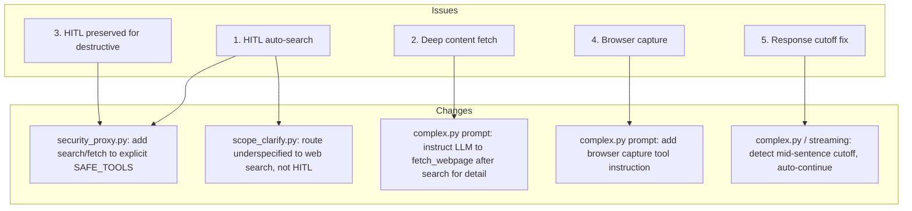

# Design: HITL Auto-Search & Deep Content Fetch

> **Purpose:** Define how the requirements will be implemented. Written in Plan mode after requirements are approved. Must be approved via AskQuestion `design-review` popup before proceeding to tasks.

## Architecture Overview

The change targets three areas in the agent pipeline: (1) the HITL classification and routing logic — making search/fetch tools always auto-execute while keeping destructive tools under HITL, and fixing `scope_clarify` to prefer web search over asking the user; (2) prompt/instruction changes to make the LLM autonomously call `fetch_webpage` after search when it needs detail; and (3) the response streaming pipeline to prevent mid-sentence truncation. Browser capture (issue #4) routes via existing MCP browser tools rather than Tauri screen capture, since the user tests via Cursor's built-in browser.

## System Diagram



## API / Interface Design

No new API endpoints. All changes are internal to the agent graph, tool prompts, and streaming logic.

### New/Modified Internal Interfaces

| Component | Change | Type |
|-----------|--------|------|
| `src/agent/nodes/security_proxy.py` | Add `SAFE_TOOLS` allowlist (search/fetch tools explicitly bypass HITL even if they match `SENSITIVE_PATTERN_RE`) | Logic |
| `src/agent/nodes/scope_clarify.py` | Add conditional: if web tools available, skip HITL and let LLM search | Logic |
| `src/agent/nodes/complex.py` (prompt) | Inject instruction: "After web_search, if you need more detail, call fetch_webpage on result URLs" | Prompt |
| `src/agent/nodes/complex.py` (prompt) | Inject instruction about browser capture tool | Prompt |
| `src/agent/nodes/complex.py` (budget logic) | Detect mid-sentence cutoff in output, auto-loop for continuation | Logic |
| `src/api/server.py` (streaming handler) | Add `cutoff_detected` flag, append continuation marker | Logic |

## Data Model

No changes to data models or database schemas.

## Component / Module Breakdown

| Component | Responsibility | Files |
|-----------|---------------|-------|
| Security proxy policy | Explicit `SAFE_TOOLS` set for search/fetch; sensitive tools unchanged | `src/agent/hitl/policy.py` |
| HITL security node | Check `SAFE_TOOLS` before sensitive check; skip HITL for safe calls | `src/agent/nodes/security_proxy.py` |
| Scope clarification | Skip HITL when question can be answered via web search | `src/agent/nodes/scope_clarify.py` |
| Complex LLM prompt | Instruct auto-fetch_webpage after search; add browser capture guidance | `src/agent/nodes/complex.py` |
| Complex LLM budget | Detect truncated output and auto-loop for continuation | `src/agent/nodes/complex.py` |
| Streaming handler | Detect mid-sentence cuts in SSE/WS chunks | `src/api/server.py` |

## Detailed Design Decisions

### Decision 1: SAFE_TOOLS allowlist (Issues 1, 3)

**File:** `src/agent/hitl/policy.py`

Current state: `SENSITIVE_TOOLS` = `{write_workspace_file, edit_workspace_file, delete_workspace_file, notebook_run}`. Everything else is auto-execute. The web search and fetch_webpage tools are already auto-execute.

However, `scope_clarify_node` fires a HITL interrupt for underspecified build requests (e.g., "build me a web app"). This should be changed:

- If web tools are available (variant has web), skip `scope_clarify` HITL and let the LLM search
- Add a new `HITL_BYPASS_CATEGORIES` mapping: if a tool call is for information retrieval (web_search, fetch_webpage), never route to `plan_review` even if the LLM is "unsure"

### Decision 2: Scope Clarify → Web Search (Issue 1)

**File:** `src/agent/nodes/scope_clarify.py`

Add a check: if `web_on` is True and the request is an information-gathering type (not destructive), skip the HITL clarification and add a system note: "The user's request is underspecified. Use web_search to find relevant information before proceeding." Then return to `complex_llm` which will execute the search.

This fixes the core complaint: "most unsure questions can be searched on the internet without needing approval."

### Decision 3: Deep content fetch instruction (Issue 2)

**File:** `src/agent/nodes/complex.py` — system prompt section for web tools

Add to the web tool instructions:

```
When you use web_search and the snippets are too brief to answer the user's question,
call fetch_webpage on the most relevant result URLs to get the full page content.
Use the focus_query parameter to extract only the relevant sections.
```

### Decision 4: Browser capture (Issue 4)

Since the user tests via Cursor's built-in browser (not Tauri desktop), browser capture uses the existing browser MCP tools (`browser_snapshot`, `browser_take_screenshot`) which are already loaded via `mcp_client.py`. The LLM should be prompted:

```
When the user asks you to look at something in their browser, use the available
browser MCP tools (browser_snapshot, browser_take_screenshot) to capture and
read the page content.
```

No code changes needed for the backend — this is an instruction-only change.

### Decision 5: Response cutoff detection (Issue 5)

**Option A: Streaming-level detection** — In `src/api/server.py` `forward_events()` (lines 1511-1535), check if the last chunk from the LLM ends mid-sentence (no terminal punctuation, no newline). If cutoff detected, automatically re-invoke the LLM with a "continue" signal.

**Option B: LLM-level budget enforcement** — In `complex_llm_node`, after the LLM call, check if `response.response_metadata.get('finish_reason') == 'length'`. If so, append a "You were cut off. Continue from where you stopped." message and loop back.

**Chosen: Option B** — It's more reliable because finish_reason='length' is the definitive signal of truncation, whereas sniffing mid-sentence in token streams is heuristic and fragile.

## Error Handling Strategy

- **Search failure (retry + inform):** `web_search` already has a 6-tier fallback. If all tiers fail, log the error, inform the user with "Web search is currently unavailable", continue without HITL.
- **fetch_webpage failure:** Already has SSL fallback. If still fails, inform user, no HITL fallback.
- **Cutoff handling failure:** If the continuation also gets truncated, log a warning and set a max-continuation counter (3 retries max) to prevent infinite loops.

## Security Considerations

- **No weakening of HITL for destructive tools** — `SENSITIVE_TOOLS` remains unchanged
- **SAFE_TOOLS only covers read-only information retrieval** — web_search, fetch_webpage, browser_snapshot, browser_take_screenshot
- **scope_clarify skip only when web tools available** — no-web variants still use HITL for clarification
- **Continuation loop capped** at 3 retries to prevent runaway token consumption

## Trade-offs and Decisions

| Decision | Rationale | Alternatives Considered |
|----------|-----------|------------------------|
| SAFE_TOOLS allowlist (not modifying SENSITIVE_TOOLS) | Clear separation of concerns; doesn't touch existing sensitive classification | Adding a `not sensitive` condition to the existing check — riskier, more coupled |
| scope_clarify skip + web search note | Direct fix for the "asking permission to search" UX complaint | Removing scope_clarify entirely — too aggressive, some requests genuinely need clarification |
| Option B for cutoff detection (finish_reason='length') | Definite signal, no false positives | Option A (streaming heuristic) — fragile, language-dependent |
| Browser capture via MCP tools (instruction only) | Zero backend changes needed; works with Cursor browser | Tauri screen capture — requires desktop app, not applicable to browser testing |
| System prompt instruction for deep fetch | Lightest-touch change; the tools already exist | Adding a tool-use validation hook — over-engineered for this use case |

## Open Questions

- [ ] Should scope_clarify be skipped entirely when web is on, or only for specific patterns (e.g., underspecified build requests vs. ambiguous intent)?
- [ ] For cutoff detection: what's the current `finish_reason` behavior from LM Studio? Does it reliably return 'length' when max_tokens is hit?
- [ ] Should we expose `max_continuation_rounds` as a configurable setting?

## References

- `requirements.md` — acceptance criteria to satisfy
- `plan_ref: .cursorplan/active/hitl-auto-search-deep-fetch/plan.md`
- `specs/completed/multi-chat-hitl-test/` — previous SDD for HITL testing
- `src/agent/hitl/policy.py` — HITL tool classification
- `src/agent/nodes/security_proxy.py` — HITL security gate
- `src/agent/nodes/scope_clarify.py` — scope clarification node
- `src/agent/nodes/complex.py` — complex LLM node (prompts + budget)
- `src/api/server.py` — streaming handler
- `src/tools/web_tools.py` — web_search, fetch_webpage implementations
- `frontend-v2/src/App.tsx` — execution_policy frontend handling

## Approval

- `design-review` AskQuestion: **approved** (2026-06-01)
