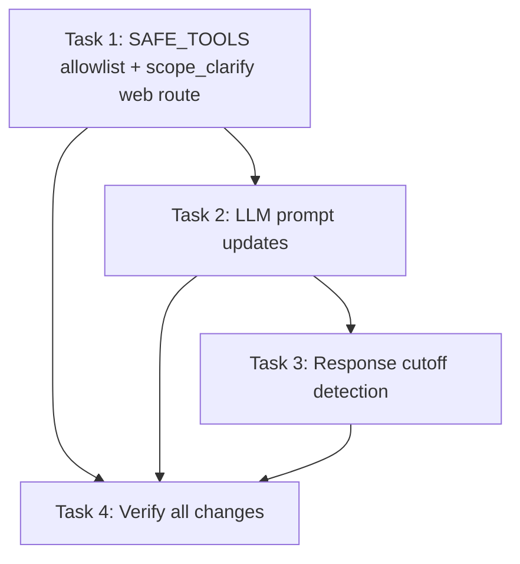

# Tasks: HITL Auto-Search & Deep Content Fetch

> **Purpose:** Implementation plan broken into checkable tasks. Written in Plan mode after design is approved. Must be approved via AskQuestion `tasks-review` popup before implementation.
>
> **plan_ref:** `.cursorplan/active/hitl-auto-search-deep-fetch/plan.md`

## Task Sequence

---

### Task 1: SAFE_TOOLS allowlist + scope_clarify web route

- **Depends on:** none
- **Maps to:** AC-1, AC-4, AC-5
- **Files:**
  - `src/agent/hitl/policy.py` — add `_is_information_retrieval()` helper and `SAFE_TOOLS` set
  - `src/agent/nodes/security_proxy.py` — import `SAFE_TOOLS`, check it before sensitive classification
  - `src/agent/nodes/scope_clarify.py` — add web-search bypass: if web tools available and request is information-gathering, skip HITL and return "use web_search" note
- **Description:** Create an explicit safe-tools classification that marks web_search, fetch_webpage, and browser MCP tools as always-auto-execute. Modify scope_clarify to route underspecified factual questions to web search instead of HITL.

#### verify_steps

- [ ] `cd /Users/tim/Works/OwlynnV2 && .venv/bin/python -c "from src.agent.hitl.policy import SAFE_TOOLS, SENSITIVE_TOOLS; assert 'web_search' in SAFE_TOOLS; assert 'write_workspace_file' in SENSITIVE_TOOLS; assert 'web_search' not in SENSITIVE_TOOLS"` — classification integrity
- [ ] `cd /Users/tim/Works/OwlynnV2 && .venv/bin/python -m pytest tests/ -x -q --tb=short -m "not network" 2>&1 | tail -5` — existing non-network tests pass

---

### Task 2: LLM prompt updates (deep fetch + browser capture)

- **Depends on:** Task 1
- **Maps to:** AC-2, AC-3, AC-7
- **Files:**
  - `src/agent/nodes/complex.py` — add to system prompt section:
    1. After web_search, call fetch_webpage on result URLs if snippets are insufficient
    2. When user asks about browser content, use browser_* MCP tools to capture/read
- **Description:** Add two prompt instructions to the complex LLM system prompt to guide the LLM's tool-use behavior for deep content fetching and browser capture.

#### verify_steps

- [ ] `cd /Users/tim/Works/OwlynnV2 && rg "fetch_webpage" src/agent/nodes/complex.py` — deep fetch instruction present
- [ ] `cd /Users/tim/Works/OwlynnV2 && rg "browser_snapshot|browser_take_screenshot" src/agent/nodes/complex.py` — browser capture instruction present
- [ ] `cd /Users/tim/Works/OwlynnV2 && .venv/bin/python -m pytest tests/ -x -q --tb=short -m "not network" 2>&1 | tail -5` — existing tests pass

---

### Task 3: Response cutoff detection

- **Depends on:** Task 2
- **Maps to:** AC-8
- **Files:**
  - `src/agent/nodes/complex.py` — after LLM invoke, check `finish_reason == 'length'`; if so, append continuation message and set `_cutoff_retry` counter (max 3)
- **Description:** Detect when the LLM hits its token budget mid-sentence and automatically loop for continuation instead of requiring the user to type "continue".

#### verify_steps

- [ ] `cd /Users/tim/Works/OwlynnV2 && .venv/bin/python -c "from src.agent.nodes.complex import MAX_CUTOFF_RETRIES; assert 0 < MAX_CUTOFF_RETRIES <= 5"` — sane limit
- [ ] `cd /Users/tim/Works/OwlynnV2 && .venv/bin/python -m pytest tests/ -x -q --tb=short -m "not network" 2>&1 | tail -5` — existing tests pass

---

### Task 4: Verify all changes

- **Depends on:** Task 1, Task 2, Task 3
- **Maps to:** All ACs
- **Files:** none (verification only)
- **Description:** Run full test suite, run CI, and verify the manual test scenarios from the design document.

#### verify_steps

- [ ] `cd /Users/tim/Works/OwlynnV2 && .venv/bin/python -m pytest tests/ -x -q --tb=short -m "not network" 2>&1 | tail -10` — all non-network tests pass
- [ ] `cd /Users/tim/Works/OwlynnV2 && bash scripts/ci.sh --quick 2>&1 | tail -10` — local CI passes
- [ ] Manual verification: start server, send "What's the latest news about AI?" — should auto-search without HITL
- [ ] Manual verification: send "Read the content of https://example.com" — should fetch full page
- [ ] Manual verification: send a long prompt that should generate a long response — should not cut off mid-sentence

---

## Verification Checklist (for feature-verify-review)

| AC ID | Met By Tasks |
|-------|-------------|
| AC-1 | Task 1 |
| AC-2 | Task 2 |
| AC-3 | Task 2 |
| AC-4 | Task 1 |
| AC-5 | Task 1 |
| AC-6 | Task 1 (existing fallback) |
| AC-7 | Task 2 |
| AC-8 | Task 3 |

## Approval

- `tasks-review` AskQuestion: pending
