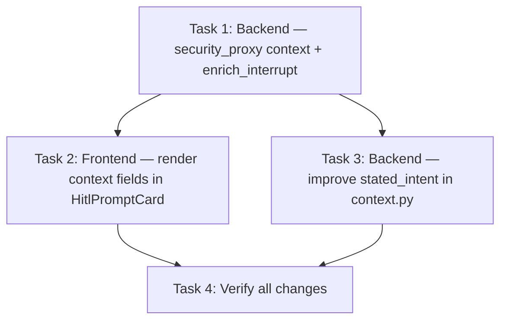

# Tasks: Context-Aware HITL Prompts

> **Purpose:** Implementation plan broken into checkable tasks. Written in Plan mode after design is approved. Must be approved via AskQuestion `tasks-review` popup before implementation.
>
> **plan_ref:** `.cursorplan/active/hitl-context-awareness/plan.md`

## Task Sequence

---

### Task 1: Backend — wire `enrich_interrupt()` into security_proxy

- **Depends on:** none
- **Maps to:** AC-1, AC-2, AC-5, AC-6
- **Files:**
  - `src/agent/nodes/security_proxy.py` — import `enrich_interrupt` from `src.agent.hitl.context`; call it on the interrupt payload; add `_build_title()` and `_build_reason()` helpers that produce context-aware text from tool name + args; include `tool_args` in payload
- **Description:** This is the main fix. Currently `security_proxy` builds a raw interrupt with generic text. Wire it through `enrich_interrupt()` to attach conversation_snippet, stated_intent, and affected_resources. Also replace the hardcoded title/reason with dynamic text derived from the tool call.

#### verify_steps

- [ ] `cd /Users/tim/Works/OwlynnV2 && .venv/bin/python -c "from src.agent.nodes.security_proxy import security_proxy_node; print('import OK')"` — no import errors
- [ ] `cd /Users/tim/Works/OwlynnV2 && grep 'enrich_interrupt' src/agent/nodes/security_proxy.py` — enrich_interrupt call present
- [ ] `cd /Users/tim/Works/OwlynnV2 && .venv/bin/python -m pytest -x -q --tb=short --ignore=tests/benchmarks --ignore=tests/test_skill_matcher.py -m 'not network' 2>&1 | tail -3` — existing tests pass

---

### Task 2: Frontend — render context fields in HitlPromptCard

- **Depends on:** Task 1
- **Maps to:** AC-3, AC-4, AC-7
- **Files:**
  - `frontend-v2/src/components/HitlPromptCard.tsx` — add JSX to render `conversationSnippet` (collapsible `
`), render `toolArgs` as a table in `security_approval`, render `affectedResources` as a list
- **Description:** The `conversationSnippet` is already parsed into the view model but not rendered. Wire it into the JSX for all 4 HITL variants. Add tool args display for security_approval. Add affected resources display.

#### verify_steps

- [ ] `cd /Users/tim/Works/OwlynnV2/frontend-v2 && grep -c 'conversationSnippet' src/components/HitlPromptCard.tsx` — grep for JSX references (should be >4, currently 4 = only in parser)
- [ ] `cd /Users/tim/Works/OwlynnV2/frontend-v2 && npx vitest run --reporter=verbose 2>&1 | tail -10` — frontend tests pass
- [ ] `cd /Users/tim/Works/OwlynnV2/frontend-v2 && npx tsc --noEmit 2>&1 | tail -5` — TypeScript compiles

---

### Task 3: Backend — improve `stated_intent` in context.py

- **Depends on:** Task 1
- **Maps to:** AC-5
- **Files:**
  - `src/agent/hitl/context.py` — improve `build_hitl_context()` or add a new helper that extracts intent from pending tool call names + args rather than just the last AI message content
- **Description:** The current `stated_intent` is `"Owlynn wants to {truncated_last_AI_content}"` which is weak. Replace with a tool-aware description mapping tool names to human-readable actions (e.g., `"Owlynn wants to write to file report.txt"`).

#### verify_steps

- [ ] `cd /Users/tim/Works/OwlynnV2 && .venv/bin/python -c "from src.agent.hitl.context import build_hitl_context; print('import OK')"` — no import errors
- [ ] `cd /Users/tim/Works/OwlynnV2 && .venv/bin/python -m pytest -x -q --tb=short --ignore=tests/benchmarks --ignore=tests/test_skill_matcher.py -m 'not network' 2>&1 | tail -3` — existing tests pass

---

### Task 4: Verify all changes

- **Depends on:** Task 1, Task 2, Task 3
- **Maps to:** All ACs
- **Files:** none (verification only)
- **Description:** Run full CI, verify import integrity, and confirm the complete data flow.

#### verify_steps

- [ ] `cd /Users/tim/Works/OwlynnV2 && bash scripts/ci.sh --quick 2>&1 | tail -10` — local CI passes
- [ ] Manual browser check: set Execution policy to "Manual approval (HITL)", send "Create a file named test.txt", verify HITL card shows conversation context + tool args + affected resources

---

## Verification Checklist (for feature-verify-review)

| AC ID | Met By Tasks |
|-------|-------------|
| AC-1 | Task 1 |
| AC-2 | Task 1 |
| AC-3 | Task 2 |
| AC-4 | Task 2 |
| AC-5 | Task 1, Task 3 |
| AC-6 | Task 1 |
| AC-7 | Task 2 |

## Approval

- `tasks-review` AskQuestion: **approved** (2026-06-01)
