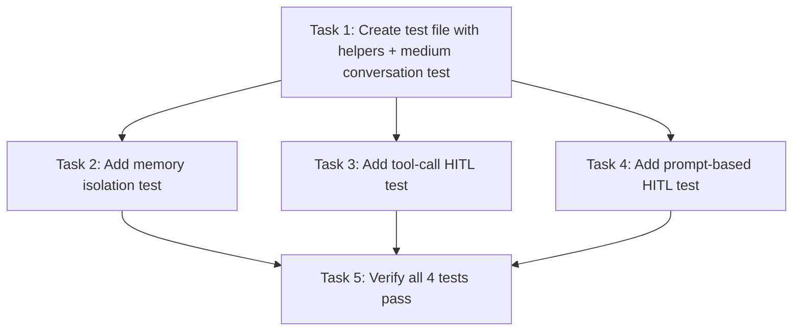

# Tasks: Multi-Chat HITL & Memory Isolation Test

> **Purpose:** Implementation plan broken into checkable tasks. Written in Plan mode after design is approved.
>
> **plan_ref:** `.cursorplan/active/multi-chat-hitl-test/plan.md`

## Task Sequence

---

### Task 1: Create test file with helpers + `test_medium_conversation_20_turns`

- **Depends on:** none
- **Maps to:** AC-1
- **Files:**
  - `tests/test_multi_chat_hitl_e2e.py` — new file with shared fixtures, helpers, and first test
- **Description:** Create `tests/test_multi_chat_hitl_e2e.py` with:
  - Shared helpers: `_create_chat()`, `_send_message()`, `_switch_to_chat()`, `_fetch_history()`, `_fetch_audit_entries()`, `_launch_browser_or_skip()`, `_assert_connection_healthy()`
  - Test function `test_medium_conversation_20_turns` that opens a chat, sends 20+ messages, and asserts coherent responses and context retention (each response references prior turn content)

#### verify_steps

- [ ] `cd /Users/tim/Works/OwlynnV2 && .venv/bin/python -m pytest tests/test_multi_chat_hitl_e2e.py::test_medium_conversation_20_turns -x -v --tb=short -m network 2>&1` — expected: exit 0, "1 passed"

---

### Task 2: Add `test_memory_isolation_between_chats`

- **Depends on:** Task 1
- **Maps to:** AC-2, AC-6
- **Files:**
  - `tests/test_multi_chat_hitl_e2e.py` — add helper `_assert_no_cross_reference()` and second test function
- **Description:** Add `test_memory_isolation_between_chats` that:
  1. Opens chat A, sends 5+ turns with distinctive content (`MEMORY_LEAK_SENTINEL_A`)
  2. Opens chat B (new thread), sends greeting
  3. Fetches history JSON for both chats via API
  4. Asserts zero references to chat A's sentinel content in chat B's history
  5. Asserts audit log entries are scoped by thread_id (no cross-contamination)

#### verify_steps

- [ ] `cd /Users/tim/Works/OwlynnV2 && .venv/bin/python -m pytest tests/test_multi_chat_hitl_e2e.py::test_memory_isolation_between_chats -x -v --tb=short -m network 2>&1` — expected: exit 0, "1 passed"

---

### Task 3: Add `test_tool_call_hitl_in_chat`

- **Depends on:** Task 1
- **Maps to:** AC-3, AC-5
- **Files:**
  - `tests/test_multi_chat_hitl_e2e.py` — add helpers `_trigger_tool_hitl()`, `_confirm_hitl()` and third test function
- **Description:** Add `test_tool_call_hitl_in_chat` that:
  1. Opens chat A, sends message that triggers a sensitive tool (e.g., "create a file named hello.txt with content 'world'")
  2. Asserts `.hitl-prompt-card.hitl-pending` appears within 30s
  3. Asserts the card contains `security_approval` variant (badge text "sensitive")
  4. Clicks `Allow` button (`.hitl-btn-approve`)
  5. Asserts HITL resolves cleanly and conversation continues in chat A
  6. Opens chat B, verifies no HITL artifacts/interrupts appear in B's history
  7. Asserts audit log entries for the HITL event scoped to chat A's thread_id

#### verify_steps

- [ ] `cd /Users/tim/Works/OwlynnV2 && .venv/bin/python -m pytest tests/test_multi_chat_hitl_e2e.py::test_tool_call_hitl_in_chat -x -v --tb=short -m network 2>&1` — expected: exit 0, "1 passed"

---

### Task 4: Add `test_prompt_based_hitl_in_chat`

- **Depends on:** Task 1
- **Maps to:** AC-4, AC-5
- **Files:**
  - `tests/test_multi_chat_hitl_e2e.py` — add helper `_trigger_prompt_hitl()` and fourth test function
- **Description:** Add `test_prompt_based_hitl_in_chat` that:
  1. Opens chat A, sends an underspecified build request (e.g., "build me a web app")
  2. Asserts `.hitl-prompt-card.hitl-pending` appears within 30s
  3. Asserts the card contains `scope_clarification` variant (badge text "Before building" and "Submit Answers" button)
  4. Selects the first choice (`.hitl-choice-btn`) and clicks `Submit Answers`
  5. Asserts HITL resolves and conversation continues in chat A
  6. Opens chat B, verifies no HITL artifacts in B's history
  7. Asserts audit log entries for this HITL event scoped to chat A's thread_id

#### verify_steps

- [ ] `cd /Users/tim/Works/OwlynnV2 && .venv/bin/python -m pytest tests/test_multi_chat_hitl_e2e.py::test_prompt_based_hitl_in_chat -x -v --tb=short -m network 2>&1` — expected: exit 0, "1 passed"

---

### Task 5: Run ALL tests and finalize

- **Depends on:** Task 2, Task 3, Task 4
- **Maps to:** AC-1, AC-2, AC-3, AC-4, AC-5, AC-6
- **Files:** none (verification only)
- **Description:** Run all 4 tests in sequence and assert all pass. If any fail, fix and re-run.

#### verify_steps

- [ ] `cd /Users/tim/Works/OwlynnV2 && .venv/bin/python -m pytest tests/test_multi_chat_hitl_e2e.py -x -v --tb=short -m network 2>&1` — expected: exit 0, "4 passed"
- [ ] Cleanup: ensure test projects are deleted (completed in teardown)

---

## Verification Checklist (for feature-verify-review)

| AC ID | Met By Tasks |
|-------|-------------|
| AC-1 | Task 1 |
| AC-2 | Task 2 |
| AC-3 | Task 3 |
| AC-4 | Task 4 |
| AC-5 | Task 3, Task 4 |
| AC-6 | Task 2 |

## Approval

- `tasks-review` AskQuestion: **approved** (2026-05-31)
