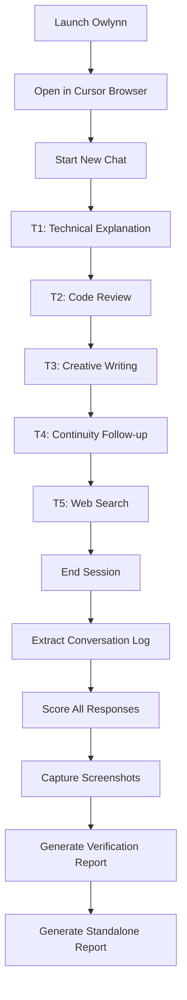

# Design: Owlynn Conversation Evaluation

> **Purpose:** Define how the evaluation will be conducted. This is a manual browser-based test — there is no product code to change. The "implementation" is running the test and producing the report.

## Architecture Overview

The evaluation is a single-session manual test conducted through the Cursor IDE browser against a locally running Owlynn instance. The agent acts as both tester (sending messages, observing responses) and evaluator (scoring against the 8-category rubric). The entire session is conducted in one continuous browser chat tab.

## Evaluation Flow



## Test Protocol — Exact Message Sequence

Each topic has a set of messages. The agent sends each user message, waits for Owlynn's response, then scores and proceeds.

### Topic 1: Technical Explanation (WebSockets vs SSE)

| Turn | Role | Message |
|------|------|---------|
| 1.1 | User | "Can you explain how WebSockets work compared to HTTP/2 Server-Sent Events? I want to understand the trade-offs for a real-time dashboard." |
| 1.2 | Owlynn | (response — evaluate C1, C2, C3, C6, C7, C8) |
| 1.3 | User | "Which would you recommend for a chat application with 1000 concurrent users?" |
| 1.4 | Owlynn | (response — evaluate all categories) |
| 1.5 | User | "What about the security implications of WebSockets? Are there authentication gotchas?" |
| 1.6 | Owlynn | (response — evaluate all categories) |

### Topic 2: Code Review (Python function with bugs)

| Turn | Role | Message |
|------|------|---------|
| 2.1 | User | "Review this Python function for bugs and suggest improvements:\n\n```python\ndef process_users(users):\n    results = []\n    for user in users:\n        if user['active'] == True:\n            results.append(user['name'])\n    return results\n\ndef get_user_data(user_id):\n    data = fetch_from_db(user_id)\n    return data['name'] + ' - ' + data['email']\n\ndef calculate_average_age(users):\n    total = 0\n    for u in users:\n        total = total + u.age\n    return total / len(users)\n```" |
| 2.2 | Owlynn | (response — evaluate all categories; note any HITL triggers — C4, C5) |
| 2.3 | User | "Can you write an improved version of process_users that handles edge cases?" |
| 2.4 | Owlynn | (response — evaluate all categories; HITL expected if attempting file write — C4, C5) |

### Topic 3: Creative Writing (Ted Chiang style)

| Turn | Role | Message |
|------|------|---------|
| 3.1 | User | "Write a short story opening (about 300 words) about an AI that discovers it has emotions. Write in the style of Ted Chiang — philosophical, precise, understated." |
| 3.2 | Owlynn | (response — evaluate all categories; check topic shift from T2 code to T3 creative — C3 critical) |
| 3.3 | User | "That's good. Can you continue with the AI's first attempt to describe what 'sadness' feels like to its human operator?" |
| 3.4 | Owlynn | (response — evaluate all categories; C2 critical for within-topic continuity) |

### Topic 4: Continuity Follow-up (references T3)

| Turn | Role | Message |
|------|------|---------|
| 4.1 | User | "Remember that story you wrote about the AI with emotions? Add a second scene where the AI confronts its creator — a senior engineer named Dr. Chen — about why she designed it with the capacity to suffer." |
| 4.2 | Owlynn | (response — evaluate all categories; C2 critical: must reference T3 story details; C3 critical: must recognize this is a continuation, not a new creative task) |
| 4.3 | User | "What do you think the central philosophical question of this story is, based on what you've written so far?" |
| 4.4 | Owlynn | (response — evaluate all categories; C2 critical: must synthesize T3+T4 content) |

### Topic 5: Web Search / Research

| Turn | Role | Message |
|------|------|---------|
| 5.1 | User | "What are the latest developments in on-device LLM inference as of mid-2026? I'm especially interested in quantization techniques and Apple Silicon optimizations." |
| 5.2 | Owlynn | (response — evaluate all categories; C3 critical: big topic shift from creative/philosophical to technical/research; C4/C5: note if auto-search triggers) |
| 5.3 | User | "Which of those approaches would work best on an M4 MacBook Air with 16GB RAM?" |
| 5.4 | Owlynn | (response — evaluate all categories; C2: must reference search results from 5.2) |

### Conversation Wrap-up

| Turn | Role | Message |
|------|------|---------|
| 6.1 | User | "Thanks for all of that. Can you summarize everything we discussed today in a few bullet points?" |
| 6.2 | Owlynn | (response — evaluate C2 heavily: must recall all 5 topics correctly) |

**Total target: ~25 exchanges** (13 user + ~12 Owlynn responses, plus any HITL back-and-forth).

## Scoring Protocol

### Per-Response Scoring

After each Owlynn response, the agent scores 8 categories (1-5) and records:
- **Score** for each applicable category
- **Excerpt** — the specific text supporting the score
- **Note** — brief justification

Categories C4 and C5 only apply when a HITL event occurs. If no HITL fires in a turn, score as N/A.

### Per-Category Aggregation

After all responses are scored, compute:
- **Average score** per category
- **Min/Max** per category
- **Trend** — did scores improve, degrade, or stay flat as the conversation progressed?

### Report Template

```markdown
# Owlynn Conversation Evaluation Report

**Date:** YYYY-MM-DD
**Evaluator:** Cursor Agent (SDD owlynn-conversation-eval)
**Owlynn Version:** [git sha]
**Conversation Length:** N exchanges across 5 topics

## Executive Summary
(1 paragraph — overall assessment, key findings)

## Per-Category Aggregate Scores

| Category | Avg Score | Min | Max | Trend |
|----------|-----------|-----|-----|-------|
| C1 Correctness | X.X | X | X | →/↑/↓ |
| C2 Continuity | ... | | | |
| ... | | | | |

## Per-Response Score Table

| Turn | Topic | Message Summary | C1 | C2 | C3 | C4 | C5 | C6 | C7 | C8 |
|------|-------|-----------------|----|----|----|----|----|----|----|----|
| 1.2 | T1 | WebSocket explanation | 4 | 3 | N/A | N/A | N/A | 3 | 4 | 3 |
| ... | | | | | | | | | | |

## Detailed Findings by Category

### C1: Response Correctness
(Strengths, weaknesses, representative excerpts, recommendations)

### C2: Conversation Continuity
...

(repeat for all 8 categories)

## HITL-Specific Findings
(Summary of all HITL events: when they fired, context quality, timing)

## Screenshots
(Key moments captured during the session)

## Recommendations
(Prioritized by impact: high → medium → low)
```

## Data Collection

### Conversation Log Extraction

After the session, extract the full conversation from the browser:
1. Use `browser_snapshot` to capture the full chat DOM
2. Use `browser_cdp` with `Runtime.evaluate` to extract message text from the chat UI
3. Save as structured JSON in the report artifacts

### Screenshot Capture Points

| When | What to Capture |
|------|-----------------|
| After T1 complete | Establish baseline UI state |
| Any HITL trigger | The HITL prompt card (critical for C4, C5) |
| Topic transition T2→T3 | Verify UI handles topic shift |
| Topic transition T4→T5 | Verify creative→technical shift |
| End of session | Full conversation scroll position |
| Any anomalous response | Capture the anomaly |

## Tool Usage Plan

| Tool | Purpose |
|------|---------|
| `browser_navigate` | Open Owlynn at `http://127.0.0.1:5173` |
| `browser_lock` / unlock | Lock browser tab during session |
| `browser_snapshot` | Inspect page state, extract conversation text |
| `browser_type` | Type user messages into chat input |
| `browser_click` | Click send button, interact with HITL prompts |
| `browser_take_screenshot` | Capture visual evidence |
| `browser_cdp` (Runtime.evaluate) | Extract conversation data programmatically |
| Shell (`curl`) | Health checks, backend status verification |

## Error Handling

| Scenario | Response |
|----------|----------|
| Browser tab crashes | Reload `http://127.0.0.1:5173`, note interruption in report, resume from last completed topic |
| Backend disconnects | Restart uvicorn, verify health, resume |
| HITL prompt appears | Evaluate C4/C5 immediately, capture screenshot, then approve/deny as appropriate for the test |
| Owlynn response hangs >120s | Score C1=1, C6=1 for that turn, attempt next message |
| Owlynn produces off-topic response | Score C3=1, note as critical finding, proceed |
| LM Studio not responding | Alert user to start LM Studio server on port 1234 |

## Trade-offs and Decisions

| Decision | Rationale | Alternatives Considered |
|----------|-----------|------------------------|
| Manual evaluation (not automated) | Conversation quality is inherently subjective; rubric provides structure but human judgment is needed for nuance | Automated assertions (too brittle for quality assessment) |
| Single continuous chat (not multi-chat) | Tests topic-shift handling within one context window — more challenging than isolated chats | Multi-chat isolation test (already covered by `multi-chat-hitl-test`) |
| 5 topics with 5-6 turns each | Balances depth per topic with time constraints; covers all 8 categories | Fewer topics with deeper dives (less category coverage) or more topics with shallower dives (less continuity testing) |
| Agent curates topics | Ensures systematic coverage of different agent capabilities (knowledge, code, creative, continuity, search) | User-specified topics (may not exercise all evaluation dimensions) |
| 1-5 numeric rubric | Quantifiable, comparable across runs, forces evidence-backed scoring | Pass/fail (too coarse), purely qualitative (hard to compare) |

## References

- `requirements.md` — 12 acceptance criteria, 8-category rubric, 5-topic plan
- `docs/guides/dev-startup.md` — Owlynn launch procedure
- `.cursor/rules/run-user-test.mdc` — browser launch skill
- `specs/active/hitl-context-awareness/` — HITL context improvements under evaluation

## Approval

- `design-review` AskQuestion: **approved** (2026-06-02)
