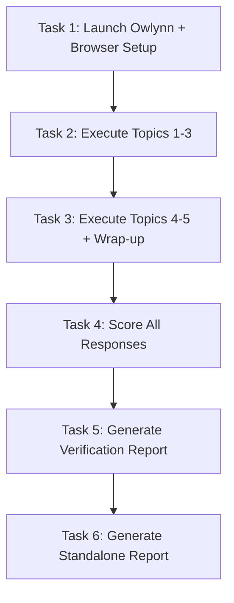

# Tasks: Owlynn Conversation Evaluation

> **Purpose:** Operational task breakdown for conducting the browser-based conversation evaluation and producing the report. No product code changes — all tasks are test execution and report generation.
>
> **plan_ref:** `.cursorplan/active/owlynn-conversation-eval/plan.md`

## Task Sequence

---

### Task 1: Launch Owlynn + Browser Setup

- **Depends on:** none
- **Maps to:** AC-1 (prerequisite for test execution)
- **Files:**
  - (no product code — operational task)
- **Description:** Start Owlynn backend (uvicorn :8000) and frontend (Vite :5173), verify all services, open Owlynn in Cursor IDE browser, and create a new chat session ready for testing.

#### verify_steps

- [x] `curl -s http://127.0.0.1:8000/api/health` — expected: HTTP 200 or JSON response indicating healthy
- [x] `curl -s http://127.0.0.1:5173` — expected: HTTP 200 (Vite dev server responding)
- [x] Browser loads Owlynn at `http://127.0.0.1:5173` with visible chat UI
- [x] New chat session created (empty message list)

---

### Task 2: Execute Test Protocol — Topics 1-3

- **Depends on:** Task 1
- **Maps to:** AC-1, AC-3, AC-4, AC-5, AC-8, AC-9, AC-10
- **Files:**
  - (no product code — browser interaction)
- **Description:** Send all messages for Topics 1 (Technical Explanation), 2 (Code Review), and 3 (Creative Writing) per the design protocol. Capture Owlynn responses, take screenshots at key transitions (T1→T2, T2→T3), and note any HITL prompts with their context.

#### verify_steps

- [x] At least 8 exchanges completed (user + Owlynn) across T1-T3
- [x] All Owlynn responses received without timeout (>120s)
- [x] Screenshots captured at T1→T2 and T2→T3 transitions
- [x] Any HITL prompts documented with screenshot and context description

---

### Task 3: Execute Test Protocol — Topics 4-5 + Wrap-up

- **Depends on:** Task 2
- **Maps to:** AC-1, AC-4, AC-5, AC-6, AC-7, AC-8, AC-9, AC-10
- **Files:**
  - (no product code — browser interaction)
- **Description:** Send all messages for Topics 4 (Continuity Follow-up — references T3 story), 5 (Web Search / Research), and the final wrap-up summary request. Pay special attention to: T4 requiring recall of T3 details, T5 triggering potential auto-search behavior, and the wrap-up requiring synthesis of all 5 topics.

#### verify_steps

- [x] Total exchanges across entire session ≥ 25 (user + Owlynn combined)
- [x] T4 responses reference specific details from T3 (story elements, characters)
- [x] T5 responses demonstrate web search or acknowledge knowledge cutoff if no search
- [x] Wrap-up summary mentions all 5 topics
- [x] Screenshots captured at T4→T5 transition and final conversation state
- [x] Any HITL prompts documented with screenshot

---

### Task 4: Score All Responses Against Rubric

- **Depends on:** Task 3
- **Maps to:** AC-2, AC-3, AC-4, AC-5, AC-6, AC-7, AC-8, AC-9, AC-10
- **Files:**
  - (scoring data recorded for report generation)
- **Description:** Extract the full conversation from the browser session. Score every Owlynn response against all 8 categories (C1-C8) using the 1-5 rubric. Record per-response scores with supporting excerpts. Compute per-category aggregates (avg, min, max, trend).

#### verify_steps

- [x] Every Owlynn response has a score for all applicable categories (C4/C5 N/A allowed if no HITL events)
- [x] Each numeric score cites at least one specific message excerpt as evidence
- [x] Per-category aggregate scores computed (avg, min, max, trend)
- [x] No category left unscored across all responses

---

### Task 5: Generate Verification Report (SDD Artifact)

- **Depends on:** Task 4
- **Maps to:** AC-2, AC-11, AC-12
- **Files:**
  - `specs/active/owlynn-conversation-eval/verification-report.md` — full evaluation report
- **Description:** Assemble the SDD verification report following the design template. Include: executive summary, per-category aggregate scores table, per-response score table, detailed findings per category, HITL-specific findings, embedded screenshots, and prioritized recommendations.

#### verify_steps

- [x] `specs/active/owlynn-conversation-eval/verification-report.md` exists and is non-empty
- [x] Report includes all required sections: executive summary, aggregate scores, per-response table, per-category findings, HITL findings, screenshots, recommendations
- [x] All 8 categories have detailed findings with evidence excerpts
- [x] Recommendations are prioritized by impact (high → medium → low)
- [x] Screenshots are embedded or linked in the report

---

### Task 6: Generate Standalone Report

- **Depends on:** Task 5
- **Maps to:** AC-12
- **Files:**
  - `docs/evaluations/owlynn-conversation-YYYY-MM-DD.md` — standalone shareable report
- **Description:** Copy the verification report to the standalone location. Add a header with metadata (date, evaluator, Owlynn version). Ensure the report is self-contained and readable without SDD context.

#### verify_steps

- [x] `docs/evaluations/owlynn-conversation-2026-06-03.md` exists
- [x] Standalone report includes date, evaluator, version metadata header
- [x] Standalone report content matches verification report (no SDD-only references)
- [x] Report is readable as a standalone document without external dependencies

---

## Verification Checklist (for feature-verify-review)

| AC ID | Met By Tasks |
|-------|-------------|
| AC-1 | Task 1, Task 2, Task 3 |
| AC-2 | Task 4, Task 5 |
| AC-3 | Task 2, Task 4 |
| AC-4 | Task 2, Task 3, Task 4 |
| AC-5 | Task 2, Task 3, Task 4 |
| AC-6 | Task 3, Task 4 |
| AC-7 | Task 3, Task 4 |
| AC-8 | Task 2, Task 3, Task 4 |
| AC-9 | Task 2, Task 3, Task 4 |
| AC-10 | Task 2, Task 3, Task 4 |
| AC-11 | Task 5, Task 6 |
| AC-12 | Task 5, Task 6 |

## Approval

- `tasks-review` AskQuestion: **approved** (2026-06-02)
