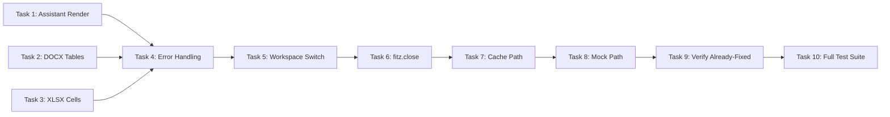

# Tasks: Phase 9 — Stabilization

> **Purpose:** Implementation plan for fixing all 10 remaining bugs. Designed to be implemented in Agent mode after approval.
>
> **plan_ref:** `.cursorplan/active/phase9-stabilization/plan.md`

## Task Sequence

---

### Task 1: Fix Assistant Message Not Rendering (AC-1)

- **Depends on:** none
- **Maps to:** AC-1
- **Files:**
  - `src/api/server.py` — Add catch-all `on_chain_end` for root-level events with AIMessage content
  - `frontend-v2/src/App.tsx` — Fix race condition in `assistant.message` handler (dual `getState().messages` reads)
- **Description:** Two-part fix. (1) Backend: in `forward_events()`, if `on_chain_end` node isn't `simple` or `complex_llm` but the event has an AIMessage with content, emit it as `assistant.message` instead of dropping silently. (2) Frontend: refactor the handler to capture messages once, compute final content from a single store snapshot, eliminating the race between line 268 and 271.

#### verify_steps

- [ ] `cd frontend-v2 && npx vitest run` — expected: all frontend tests pass (96+)
- [ ] Manual: check that assistant messages render in the chat DOM after backend responds

---

### Task 2: Extract DOCX Table Content (AC-3)

- **Depends on:** none
- **Maps to:** AC-3
- **Files:**
  - `src/api/file_processor.py` — Add `doc.tables` iteration in `_process_word()` fallback (lines 273-282)
- **Description:** After paragraph extraction, iterate `doc.tables` and append each row's cells as a pipe-delimited line prefixed with `--- Table ---`. This ensures table content from DOCX files is captured in the processed text output.

#### verify_steps

- [ ] `python -m pytest tests/audit_samples/ -q --tb=short` — expected: no regressions in file processing tests
- [ ] Generate a DOCX with known table content, verify it appears in processed output

---

### Task 3: Fix XLSX Merged Cell Headers (AC-4)

- **Depends on:** none
- **Maps to:** AC-4
- **Files:**
  - `src/api/file_processor.py` — Add second-pass cleanup for `Unnamed:` columns in `_process_table()` (post-line 247)
- **Description:** After the current promotion logic, add a secondary pass that scans remaining `Unnamed:` columns and renames them using the first non-NaN non-`Unnamed:` value found in that column across all rows. Falls back to `Column_{N}` if no valid header found.

#### verify_steps

- [ ] `python -m pytest tests/audit_samples/ -q --tb=short` — expected: no regressions
- [ ] Generate an XLSX with merged title cells, verify no `Unnamed:` in output

---

### Task 4: Fix Silent Error Handling (AC-5)

- **Depends on:** none
- **Maps to:** AC-5
- **Files:**
  - `frontend-v2/src/App.tsx` — Add `console.warn` to 5 empty catch blocks (lines 116, 207, 245, 570, 618)
  - `frontend-v2/src/lib/wsClient.ts` — Add `console.warn` to catch at line 28
  - `frontend-v2/src/components/MemoryPanel.tsx` — Add `console.warn` to catches at lines 105, 130, 147 (with error details, not just generic message)
  - `src/api/server.py` — Upgrade `except: pass` to `logger.warning` at lines 309, 438, 489, 749, 1096, 1303
  - `src/agent/nodes/memory.py` — Upgrade `except: pass` to `logger.warning` at lines 174, 193, 224
- **Description:** Replace 7 frontend empty `catch {}` blocks with `console.warn("context", error)` and 9 backend `except: pass` with `logger.warning("context", exc_info=True)`. Prioritize chat title gen, persona update, auto-index, Mem0 search.

#### verify_steps

- [ ] `cd frontend-v2 && npx vitest run` — expected: all frontend tests pass (error logging is additive, not breaking)
- [ ] `python -m pytest -q --tb=short -k "not network" tests/test_bugfix_persona_leak.py tests/test_bugfix_chat_title.py` — expected: passes

---

### Task 5: Fix Stale Workspace Switch UI (AC-6)

- **Depends on:** none
- **Maps to:** AC-6
- **Files:**
  - `frontend-v2/src/App.tsx` — Remove `activeProjectId` from `handleDeleteProject` dependency array (line 648)
- **Description:** The callback uses `activeProjectIdRef.current` for the actual value (correct), but `activeProjectId` in the dependency array re-creates the callback unnecessarily. Remove it from deps — only keep `clearSession` and `loadProjects`. The ref always reflects the latest value.

#### verify_steps

- [ ] `cd frontend-v2 && npx vitest run` — expected: all frontend tests pass

---

### Task 6: Fix `fitz.open()` Resource Leak (AC-8)

- **Depends on:** none
- **Maps to:** AC-8
- **Files:**
  - `src/api/server.py` — Add `doc.close()` after `fitz.open(stream=raw_bytes, filetype="pdf")` at ~line 1948
- **Description:** Wrap the fitz document usage in try/finally block to ensure `doc.close()` is called. The `file_processor.py` path already handles this correctly — only the server.py path is missing cleanup.

#### verify_steps

- [ ] `python -m pytest -q --tb=short -k "not network"` — expected: passes
- [ ] Code review confirms `doc.close()` is called in an `finally` block

---

### Task 7: Fix Auto-Index Cache Path (AC-9)

- **Depends on:** none
- **Maps to:** AC-9
- **Files:**
  - `src/api/server.py` — In `notify_file_processed()`, swap search order: check `root_processed` first, then `project_workspace/.processed/` only for non-default projects
- **Description:** The file watcher always writes processed cache to `WORKSPACE_DIR/.processed/` (root). The auto-index hook searches `project_workspace/.processed/` first — a guaranteed miss for non-default projects. Change to check `root_processed` first (fast path), then only fall back to per-project `.processed/` for non-default projects.

#### verify_steps

- [ ] `python -m pytest -q --tb=short -k "not network"` — expected: passes
- [ ] Code review confirms the search order is reversed

---

### Task 8: Fix Memory Benchmark Mock Path (AC-10)

- **Depends on:** none
- **Maps to:** AC-10
- **Files:**
  - `tests/benchmarks/test_memory_benchmark.py` — Change `patch("src.agent.nodes.memory.get_persona")` to `patch("src.agent.nodes.memory.get_persona_by_id")` at lines 55 and 99
- **Description:** The function was renamed/moved to `get_persona_by_id` in `src.memory.persona_manager`, but the mock still patches the old non-existent path `get_persona`. The mock silently does nothing, making benchmarks hit real Mem0/Redis. Update both mock paths.

#### verify_steps

- [ ] `python -m pytest tests/benchmarks/test_memory_benchmark.py -q --tb=short` — expected: 4 tests pass (currently fails with AttributeError)

---

### Task 9: Verify Already-Fixed Items (AC-2, AC-7)

- **Depends on:** none
- **Maps to:** AC-2, AC-7
- **Files:** (code review only, no changes needed)
  - `src/agent/graph.py` line 198 — Confirm `AsyncRedisSaver(redis_url=REDIS_URL)` uses correct kwarg
  - `frontend-v2/src/lib/tauriBridge.ts` — Confirm dynamic import pattern
  - `frontend-v2/src/components/SafeModePanel.tsx` — Confirm optimistic update + REST fallback
- **Description:** AC-2 (Redis persistence) and AC-7 (SafeMode browser fallback) were verified as already fixed during design investigation. Document verification results.

#### verify_steps

- [ ] Code review confirms `redis_url=` kwarg is correct in `graph.py:198`
- [ ] Code review confirms dynamic import in `tauriBridge.ts` lines 16-22
- [ ] Code review confirms optimistic update + REST fallback in `SafeModePanel.tsx` lines 30-44

---

### Task 10: Full Test Suite and Verification Report

- **Depends on:** Tasks 1-9
- **Maps to:** NFR-1, NFR-2
- **Files:**
  - `specs/active/phase9-stabilization/verification-report.md` — Generate after all tasks
- **Description:** Run the full test suite (backend pytest + frontend vitest). Verify no regressions. Generate verification report. If any fixes need adjustment, fix and re-run.

#### verify_steps

- [ ] `python -m pytest -q --tb=short -k "not network"` — expected: all pass (current: 880 pass, 4 fail → should be 884+ pass, 0 fail)
- [ ] `cd frontend-v2 && npx vitest run` — expected: all pass
- [ ] Generate `verification-report.md` with results for all 10 ACs

---

## Verification Checklist (for feature-verify-review)

| AC ID | Description | Met By Tasks | Status |
|-------|-------------|-------------|--------|
| AC-1 | Assistant message renders in DOM | Task 1 | pending |
| AC-2 | Redis persistence works | Task 9 (verify existing) | pending |
| AC-3 | DOCX table content extracted | Task 2 | pending |
| AC-4 | XLSX no `Unnamed:` headers | Task 3 | pending |
| AC-5 | Silent errors surfaced | Task 4 | pending |
| AC-6 | Workspace switch no stale UI | Task 5 | pending |
| AC-7 | SafeMode browser fallback | Task 9 (verify existing) | pending |
| AC-8 | `fitz.open()` closed properly | Task 6 | pending |
| AC-9 | Auto-index cache path fast | Task 7 | pending |
| AC-10 | Memory benchmark tests pass | Task 8 | pending |

## Approval

- `tasks-review` AskQuestion: **APPROVED** (2026-05-31)
- Switch to **Agent mode** to begin implementation.
