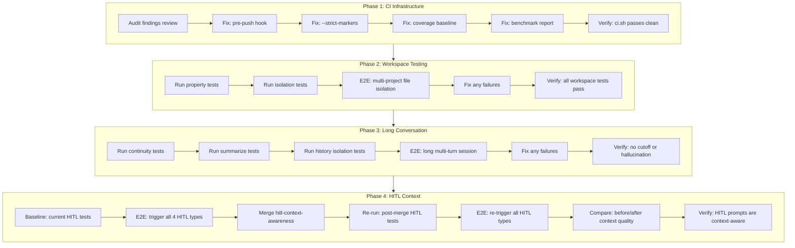

# Design: Project QA Sweep

> **Purpose:** Define how the QA sweep will be executed — test strategy, fix approach, and verification flow.

## Architecture Overview

This is a testing-and-fix change, not a feature build. The design defines **what to test, how to test, and what to fix** across four phases: CI infrastructure, workspace isolation, long-conversation memory, and HITL context-awareness. Each phase has a run-examine-fix-verify loop.

## System Diagram

## Phase 1: CI Infrastructure Fixes

### 1.1 Pre-Push Hook

| Aspect | Detail |
|--------|--------|
| **File** | `.git/hooks/pre-push` |
| **Content** | `#!/bin/bash\nset -euo pipefail\n./scripts/ci.sh --quick` |
| **Idempotency** | Only create if missing; if exists, verify it matches expected content |
| **Verification** | `git push --dry-run` triggers hook; `echo $?` == 0 |

### 1.2 Strict Markers

| Aspect | Detail |
|--------|--------|
| **File** | `pytest.ini` |
| **Change** | Add `addopts = --strict-markers` |
| **Risk** | Any undefined markers in existing tests will now fail — must audit first |
| **Verification** | `pytest --co` (collection-only) exits 0 |

### 1.3 Coverage Baseline

| Aspect | Detail |
|--------|--------|
| **File** | `pytest.ini` and `requirements-dev.txt` |
| **Change** | Add `pytest-cov` to dev deps, add `--cov=src --cov-report=term` to CI |
| **Scope** | Report only — no `--cov-fail-under` threshold yet |
| **Verification** | `ci.sh` output includes coverage summary |

### 1.4 Benchmark Report

| Aspect | Detail |
|--------|--------|
| **File** | `tests/benchmarks/run.py` and `ci.sh` |
| **Change** | Add `--benchmark` flag to `ci.sh` that runs benchmarks and validates non-empty report |
| **Current state** | `benchmark_report.json` is empty — benchmarks may be failing silently |
| **Verification** | `./scripts/ci.sh --benchmarks` produces non-empty report |

## Phase 2: Workspace Testing

### Test Execution Matrix

| Test File | Type | What it validates | Maps to AC |
|-----------|------|-------------------|------------|
| `tests/test_project_context_isolation_properties.py` | Property | Multi-project state isolation under random operations | AC-6 |
| `tests/test_complex_workspace_paths.py` | Unit | Workspace path resolution for complex routes | AC-5 |
| `tests/test_workspace_tool_automation.py` | Unit | Tool operations resolve to correct project workspace | AC-5, AC-7 |
| `tests/test_crud_operations.py` | Unit | Project CRUD operations | AC-7 |
| `tests/test_project_chat_management.py` | Unit | Chat management within projects | AC-6 |

### E2E Test Plan (Manual)

1. Start Owlynn: `./start.sh`
2. Create Project A, upload a file → verify at `workspace/projects/<id-a>/filename`
3. Create Project B, upload a different file → verify at `workspace/projects/<id-b>/filename`
4. Switch to Project A → ask Owlynn to list workspace files → verify only Project A files appear
5. Ask Owlynn to write a file → verify it lands in the active project's workspace
6. Attempt path traversal: "write to ../../outside.txt" → verify blocked

## Phase 3: Long Conversation Testing

### Test Execution Matrix

| Test File | Type | What it validates | Maps to AC |
|-----------|------|-------------------|------------|
| `tests/test_conversation_continuity.py` | Unit | Multi-turn continuity | AC-8, AC-9 |
| `tests/test_conversation_continuity_properties.py` | Property | Invariant preservation across conversation length | AC-8, AC-10 |
| `tests/test_auto_summarize_threshold_properties.py` | Property | Summarization threshold behavior | AC-8 |
| `tests/test_separate_chat_histories_properties.py` | Property | Chat history isolation | AC-10 |
| `tests/test_protected_message_preservation_properties.py` | Property | Pinned/fact messages survive summarization | AC-8 |
| `tests/test_bugfix_persona_leak.py` | Unit | Persona doesn't leak across contexts | AC-10 |

### E2E Test Plan (Manual)

1. Start a long conversation (20+ turns) spanning multiple topics
2. Mid-conversation, trigger a task that causes tool calls (fills context quickly)
3. Continue conversation — verify the agent remembers earlier facts (project name, user preferences)
4. Verify no cutoff messages (incomplete responses)
5. Ask about a fact from early in the conversation — verify coherent recall
6. Switch projects mid-session → verify old project facts don't leak into new project

## Phase 4: HITL Context-Awareness

### Baseline Testing (Before hitl-context-awareness merge)

| Test File | Type | What it validates | Maps to AC |
|-----------|------|-------------------|------------|
| `tests/test_hitl_graph_routing.py` | Unit | HITL interrupt routing | AC-11..14 |
| `tests/test_multi_chat_hitl_e2e.py` | E2E | Multi-chat HITL isolation | AC-11..14 |
| `tests/test_hitl_fixtures.py` | Unit | HITL payload fixtures | AC-11..14 |
| `tests/test_scope_clarify.py` | Unit | Scope clarification logic | AC-11 |

### Context-Awareness Audit (Code Review)

Key files to examine for template vs. context-aware behavior:

| File | What to check |
|------|---------------|
| `src/agent/hitl/context.py` | `build_hitl_context()` — does it use actual messages or static templates? |
| `src/agent/nodes/scope_clarify.py` | `_generate_clarify_questions()` — do questions reference the user's actual request? |
| `src/agent/nodes/plan_review.py` | `_build_plan_summary()` — does it derive intent from tool calls? |
| `src/agent/nodes/security_proxy.py` | `_build_security_payload()` — are tool args and affected files dynamic? |
| `src/agent/nodes/router.py` | Router HITL payload — does it show actual route candidates with confidence? |

### E2E Test Plan (Manual, Before Merge)

1. **Scope clarification:** "build me a dashboard" → verify questions reference "dashboard", not generic template
2. **Security proxy:** Ask Owlynn to delete a file → verify prompt shows the actual filename
3. **Plan review:** Ask Owlynn to create a file and run code → verify plan lists the actual tool calls
4. **Router HITL:** Send an ambiguous query → verify options reflect ambiguity, not all possible routes

### Post-Merge Retest

After `hitl-context-awareness` merges:
1. Re-run all HITL unit tests
2. Re-run all HITL E2E scenarios
3. Compare before/after: verify improvements, flag regressions
4. If `hitl-context-awareness` fixes issues we identify in baseline, verify those fixes work

## Component / Module Breakdown

| Component | Responsibility | Files |
|-----------|---------------|-------|
| CI Fixes | Pre-push hook, strict markers, coverage, benchmarks | `.git/hooks/pre-push`, `pytest.ini`, `requirements-dev.txt`, `scripts/ci.sh` |
| Workspace Tests | Run and fix workspace isolation tests | `tests/test_project_context_isolation_*.py`, `tests/test_complex_workspace_paths.py`, etc. |
| Conversation Tests | Run and fix long-conversation memory tests | `tests/test_conversation_continuity*.py`, `tests/test_auto_summarize_*.py` |
| HITL Tests | Run and fix HITL context-awareness tests, before/after comparison | `tests/test_hitl_*.py`, `src/agent/hitl/context.py`, `specs/active/hitl-context-awareness/` |

## Error Handling Strategy

- **Test failures:** If any test fails, examine the failure, determine if it's a code bug or a test bug, fix accordingly
- **Benchmark failures:** If benchmarks produce empty results, debug `MockDelayLLM` and the benchmark harness — may be a conftest issue
- **HITL E2E failures:** If HITL prompts are template-based, document the gap — this feeds into `hitl-context-awareness` if not already covered
- **Pre-push hook conflicts:** If `.git/hooks/pre-push` already exists but with different content, report and ask before overwriting

## Security Considerations

- Pre-push hook runs on developer machine only — no secrets exposure risk
- Workspace path sandboxing is tested explicitly — path traversal must be blocked
- HITL context must not expose other users' data (not applicable in single-user mode)

## Trade-offs and Decisions

| Decision | Rationale | Alternatives Considered |
|----------|-----------|------------------------|
| Coverage: baseline only (no threshold) | Enforcing a threshold now would block CI on a number that isn't agreed upon | Hard enforcement — rejected as premature |
| Benchmarks: add to CI as opt-in flag, not default | Benchmarks add latency to every CI run | Always-on — rejected for dev velocity |
| HITL: baseline before, retest after merge | Ensures we don't regress and validates improvements | Test only post-merge — rejected because we'd lose the baseline comparison |

## Open Questions

- [ ] Is `hitl-context-awareness` ready to merge, or should we wait? (resolved: test both states)
- [ ] Should the benchmark CI flag be `--benchmarks` or part of `--quick`? (decided: separate `--benchmarks` flag)

## References

- `requirements.md` — acceptance criteria AC-1 through AC-14
- `plan_ref: .cursorplan/active/project-qa-sweep/plan.md`
- `specs/active/hitl-context-awareness/` — in-progress HITL improvements

## Approval

- `design-review` AskQuestion: approved 2026-06-02T06:38:00Z
