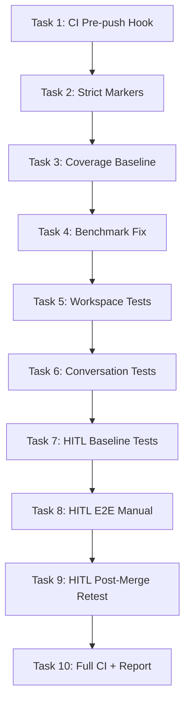

# Tasks: Project QA Sweep

> **Purpose:** Implementation plan broken into checkable tasks. Four phases: CI fixes, workspace testing, conversation testing, HITL testing.
>
> **plan_ref:** `.cursorplan/active/project-qa-sweep/plan.md`

## Task Sequence

---

### Task 1: Recreate Pre-Push Hook

- **Depends on:** none
- **Maps to:** AC-1
- **Files:**
  - `.git/hooks/pre-push` — create if missing
- **Description:** Create the pre-push hook that runs `scripts/ci.sh --quick`. If an existing hook with different content exists, verify it's compatible before overwriting.

#### verify_steps

- [ ] `ls -la .git/hooks/pre-push` — file exists and is executable
- [ ] `bash .git/hooks/pre-push` — runs `scripts/ci.sh --quick` (may fail on test failures, but must not fail on hook syntax)
- [ ] `cat .git/hooks/pre-push` — content matches expected template

---

### Task 2: Add --strict-markers to pytest.ini

- **Depends on:** Task 1
- **Maps to:** AC-2
- **Files:**
  - `pytest.ini` — add `--strict-markers` to addopts
- **Description:** Add `addopts = --strict-markers` to pytest.ini. First run `pytest --markers` to audit all existing markers, then run collection-only to verify no undefined markers break.

#### verify_steps

- [ ] `pytest --co -q` — collection succeeds with exit 0
- [ ] `pytest --markers` — all markers match those declared in pytest.ini
- [ ] `grep "strict-markers" pytest.ini` — confirms the flag is present

---

### Task 3: Add Coverage Baseline Config

- **Depends on:** Task 2
- **Maps to:** AC-4
- **Files:**
  - `requirements-dev.txt` — add `pytest-cov`
  - `pytest.ini` — add `--cov=src --cov-report=term` to addopts (or `scripts/ci.sh`)
- **Description:** Add pytest-cov dependency and configure CI to report coverage. No `--cov-fail-under` threshold yet — report only.

#### verify_steps

- [ ] `pip install pytest-cov` — install succeeds
- [ ] `pytest --co -q` — collection still succeeds after adding cov flags
- [ ] `pytest -q -m "not network" --cov=src --cov-report=term --tb=short 2>&1 | grep "TOTAL"` — coverage summary appears in output

---

### Task 4: Fix Benchmark Report and Add --benchmarks CI Flag

- **Depends on:** Task 3
- **Maps to:** AC-3
- **Files:**
  - `tests/benchmarks/run.py` — verify benchmarking harness works
  - `scripts/ci.sh` — add `--benchmarks` flag
- **Description:** Investigate why `benchmark_report.json` is empty. Fix any harness issues. Add `--benchmarks` flag to `ci.sh` that runs benchmarks and validates the report is non-empty.

#### verify_steps

- [ ] `python tests/benchmarks/run.py --quick` — produces non-empty `benchmark_report.json`
- [ ] `python -c "import json; r=json.load(open('tests/benchmarks/benchmark_report.json')); assert r['total_entries'] > 0"` — report has results
- [ ] `./scripts/ci.sh --benchmarks` — runs benchmark stage and exits clean

---

### Task 5: Run and Validate Workspace Isolation Tests

- **Depends on:** Task 4
- **Maps to:** AC-5, AC-6, AC-7
- **Files:**
  - `tests/test_project_context_isolation_properties.py` — run and fix
  - `tests/test_complex_workspace_paths.py` — run and fix
  - `tests/test_workspace_tool_automation.py` — run and fix
  - `tests/test_crud_operations.py` — run and fix
  - `tests/test_project_chat_management.py` — run and fix
- **Description:** Run all workspace-related test files. If any fail, examine the failure, determine if it's a code bug or test issue, and fix. Document findings.

#### verify_steps

- [ ] `pytest tests/test_project_context_isolation_properties.py -q --tb=short` — exit 0
- [ ] `pytest tests/test_complex_workspace_paths.py -q --tb=short` — exit 0
- [ ] `pytest tests/test_workspace_tool_automation.py -q --tb=short` — exit 0
- [ ] `pytest tests/test_crud_operations.py tests/test_project_chat_management.py -q --tb=short` — exit 0
- [ ] `grep -r "get_safe_workspace_path\|tool_workspace_root" src/tools/` — sandboxing functions are referenced

---

### Task 6: Run and Validate Long Conversation Tests

- **Depends on:** Task 5
- **Maps to:** AC-8, AC-9, AC-10
- **Files:**
  - `tests/test_conversation_continuity.py` — run and fix
  - `tests/test_conversation_continuity_properties.py` — run and fix
  - `tests/test_auto_summarize_threshold_properties.py` — run and fix
  - `tests/test_separate_chat_histories_properties.py` — run and fix
  - `tests/test_protected_message_preservation_properties.py` — run and fix
  - `tests/test_bugfix_persona_leak.py` — run and fix
- **Description:** Run all conversation memory test files. Verify auto-summarize preserves facts, cutoff auto-continuation works, and memory recall is relevant. Fix any failures.

#### verify_steps

- [ ] `pytest tests/test_conversation_continuity.py tests/test_conversation_continuity_properties.py -q --tb=short` — exit 0
- [ ] `pytest tests/test_auto_summarize_threshold_properties.py -q --tb=short` — exit 0
- [ ] `pytest tests/test_separate_chat_histories_properties.py tests/test_protected_message_preservation_properties.py -q --tb=short` — exit 0
- [ ] `pytest tests/test_bugfix_persona_leak.py -q --tb=short` — exit 0
- [ ] Verify `src/agent/nodes/summarize.py` `auto_summarize_node` has graceful degradation (Small LLM failure → skip, not crash)

---

### Task 7: Run HITL Baseline Tests and Audit Context Code

- **Depends on:** Task 6
- **Maps to:** AC-11, AC-12, AC-13, AC-14
- **Files:**
  - `tests/test_hitl_graph_routing.py` — run and fix
  - `tests/test_multi_chat_hitl_e2e.py` — run and fix
  - `tests/test_hitl_fixtures.py` — run and fix
  - `tests/test_scope_clarify.py` — run and fix
- **Description:** Run all HITL test files to establish a baseline. Then audit the HITL context-building code to check if prompts are context-aware or template-based. Document findings in CHANGELOG.

#### verify_steps

- [ ] `pytest tests/test_hitl_graph_routing.py tests/test_multi_chat_hitl_e2e.py -q --tb=short` — exit 0
- [ ] `pytest tests/test_hitl_fixtures.py tests/test_scope_clarify.py -q --tb=short` — exit 0
- [ ] Audit `src/agent/hitl/context.py` `build_hitl_context()` — verify it uses `state.get("messages")`, not static strings
- [ ] Audit `src/agent/nodes/scope_clarify.py` `_generate_clarify_questions()` — verify questions reference the actual user message
- [ ] Audit `src/agent/nodes/plan_review.py` — verify `stated_intent` derives from tool calls, not constant
- [ ] Audit `src/agent/nodes/security_proxy.py` — verify tool args and affected files come from actual pending calls

---

### Task 8: HITL E2E Manual Testing (All 4 HITL Types)

- **Depends on:** Task 7
- **Maps to:** AC-11, AC-12, AC-13, AC-14
- **Files:**
  - `frontend-v2/src/components/HitlPromptCard.tsx` — verify rendering
  - `frontend-v2/src/hitl-cards.css` — verify styling
- **Description:** Start the app and manually trigger each HITL type. Verify prompts are context-aware. Record before/after observations.

#### verify_steps

- [ ] Start app: `./start.sh` — backend + frontend running
- [ ] **Router HITL:** Send ambiguous query → verify options reflect ambiguity with confidence scores → screenshot
- [ ] **Scope Clarify:** Send "build me a tool" → verify questions reference "tool", not generic → screenshot
- [ ] **Security Proxy:** Ask to delete a file → verify prompt shows actual filename and args → screenshot
- [ ] **Plan Review:** Ask to create file + run command → verify plan lists actual tool calls → screenshot

---

### Task 9: HITL Post-Merge Retest (After hitl-context-awareness)

- **Depends on:** Task 8
- **Maps to:** AC-11, AC-12, AC-13, AC-14
- **Files:**
  - All files modified by `hitl-context-awareness` — verify merges don't regress
- **Description:** After `hitl-context-awareness` merges into the branch, re-run all HITL tests and manual E2E scenarios. Compare results with baseline. Document improvements or regressions.

#### verify_steps

- [ ] `pytest tests/test_hitl_graph_routing.py tests/test_multi_chat_hitl_e2e.py tests/test_hitl_fixtures.py tests/test_scope_clarify.py -q --tb=short` — exit 0
- [ ] Re-run all 4 HITL E2E scenarios from Task 8 → verify prompts are at least as good as baseline
- [ ] Compare before/after: document improvements in CHANGELOG

---

### Task 10: Full CI Run and Verification Report

- **Depends on:** Task 9
- **Maps to:** AC-1, AC-2, AC-3, AC-4 (cross-cutting — validates all CI fixes)
- **Files:**
  - `scripts/ci.sh` — full run
  - `specs/active/project-qa-sweep/verification-report.md` — generate
- **Description:** Run the full CI pipeline. Generate the verification report mapping each AC to its verify_steps results. Append final CHANGELOG entry.

#### verify_steps

- [ ] `./scripts/ci.sh` — all stages pass (Python + contract + frontend tests + build)
- [ ] `./scripts/ci.sh --benchmarks` — benchmark stage passes with non-empty report
- [ ] `./scripts/ci.sh --quick` — quick mode passes (used by pre-push hook)
- [ ] Generate `verification-report.md` with all AC results
- [ ] Append final CHANGELOG entry

---

## Verification Checklist (for feature-verify-review)

| AC ID | Met By Tasks |
|-------|-------------|
| AC-1 | Task 1, Task 10 |
| AC-2 | Task 2, Task 10 |
| AC-3 | Task 4, Task 10 |
| AC-4 | Task 3, Task 10 |
| AC-5 | Task 5 |
| AC-6 | Task 5 |
| AC-7 | Task 5 |
| AC-8 | Task 6 |
| AC-9 | Task 6 |
| AC-10 | Task 6 |
| AC-11 | Task 7, Task 8, Task 9 |
| AC-12 | Task 7, Task 8, Task 9 |
| AC-13 | Task 7, Task 8, Task 9 |
| AC-14 | Task 7, Task 8, Task 9 |

## Approval

- `tasks-review` AskQuestion: approved 2026-06-02T06:39:00Z
