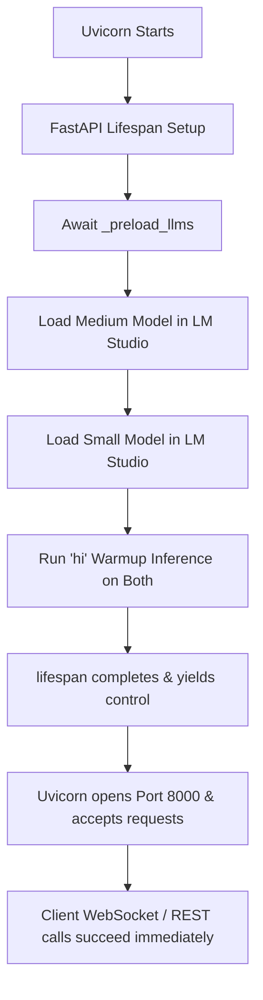

# Design: Startup Race Fix & Settings Consolidation

> **Purpose:** Address the LM Studio startup preloading race conditions and populate missing default LLM settings in the unified settings endpoint.
> **Slug:** `startup-race-fix`

## Approval

- `design-review`: approved (2026-06-04)

## Architecture Overview

1. **Synchronous Lifespan Startup:** Instead of spawning `_preload_llms()` as a background task, the FastAPI `lifespan` handler will `await _preload_llms()`. This guarantees that Uvicorn does not bind to port 8000 and start accepting traffic until both model pools are created, warmed up, and LM Studio has completely settled.
2. **Centralized Config Fallback in REST API:** The `/api/unified-settings` endpoint will check the user profile overrides. If LLM config parameters (such as `small_llm_base_url` or `medium_models`) are not present (since they were removed from the profile default values), they will be resolved from `defaults.yaml` via the centralized `config` loader and merged into the response.

## System Diagram

## Component / Module Breakdown

| Component | Responsibility | Files |
|-----------|---------------|-------|
| Startup Warmup | Await preloading and warmup before server starts listening. | `src/api/server.py` |
| Unified Settings API | Resolve default LLM parameters and variants from centralized config loader when profile keys are missing. | `src/api/server.py` |
| Verification | Run pytest on settings and ensure Uvicorn starts up cleanly. | `tests/test_unified_settings.py` |

## Trade-offs and Decisions

| Decision | Rationale | Alternatives Considered |
|----------|-----------|------------------------|
| Await lifespan setup | Guaranteed readiness before accepting client connections. Avoids complex retries on client side. | Keeping background task and adding health check + client-side polling (more complex, UI needs spinner). |
| Flat `medium_models` dict | Matches the legacy format expected by the frontend and existing unit tests. | Updating frontend and unit tests to parse the nested YAML variants structure (adds regression risk to UI). |

## Open Questions

- None.

## References

- `specs/active/startup-race-fix/requirements.md`
- `src/api/server.py`
