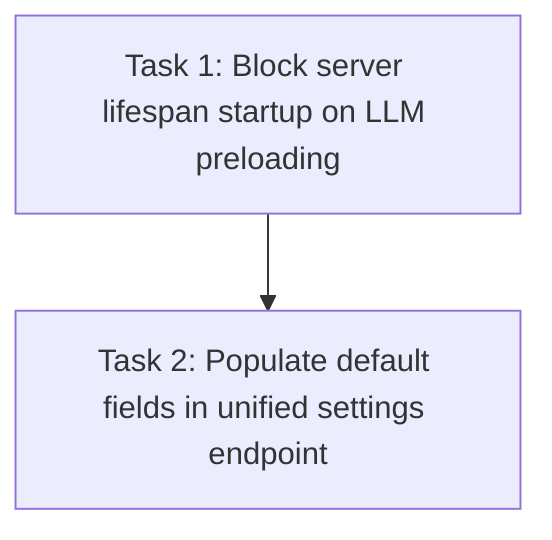

# Tasks: Startup Race Fix & Settings Consolidation

> **Purpose:** Detailed implementation steps for startup-race-fix.
> **Slug:** `startup-race-fix`
> **plan_ref:** `.cursorplan/active/startup-race-fix/plan.md`

## Task Sequence

---

### Task 1: Block server lifespan startup on LLM preloading

- **Depends on:** none
- **Maps to:** AC-1, AC-2
- **Files:**
  - `src/api/server.py` — change `asyncio.create_task(_preload_llms())` to `await _preload_llms()` inside the `lifespan` handler.
- **Description:** Blocks the FastAPI startup sequence until the small and medium models are preloaded and warmed up, guaranteeing that the server does not serve requests during LM Studio swaps.

#### verify_steps

- [ ] `.venv/bin/pytest tests/test_unified_settings.py -k test_returns_200` — expected: exit 0, server starts and responds successfully.

---

### Task 2: Populate default fields in unified settings endpoint

- **Depends on:** Task 1
- **Maps to:** AC-3
- **Files:**
  - `src/api/server.py` — update the `api_get_unified_settings` endpoint to retrieve and populate missing default LLM config fields using the config loader.
- **Description:** Merges config-loader defaults for LLM base URLs and model names into the unified settings dictionary, and flattens medium variants into a flat `medium_models` map if they are missing from the user profile.

#### verify_steps

- [ ] `.venv/bin/pytest tests/test_unified_settings.py` — expected: all 16 tests pass, exit 0.

---

## Verification Checklist (for feature-verify-review)

| AC ID | Met By Tasks |
|-------|-------------|
| AC-1 | Task 1 |
| AC-2 | Task 1 |
| AC-3 | Task 2 |

## Approval

- `tasks-review` AskQuestion: approved (2026-06-04)
