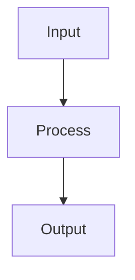

# Design: <change-title>

> **Purpose:** Define how the requirements will be implemented. Written in Plan mode after requirements are approved. Must be approved via AskQuestion `design-review` popup before proceeding to tasks.

## Architecture Overview

(2-3 sentence summary of the approach)

## System Diagram



## API / Interface Design

| Method | Path | Description | Request | Response |
|--------|------|-------------|---------|----------|
| (verb) | (/path) | (what it does) | (schema) | (schema) |

### Request/Response Examples

```json
// Example request/response
```

## Data Model

| Entity | Fields | Relations |
|--------|--------|-----------|
| (name) | (field: type) | (FK, join, etc.) |

### Migration Steps (if applicable)

1. (migration step)
2. (rollback plan)

## Component / Module Breakdown

| Component | Responsibility | Files |
|-----------|---------------|-------|
| (name) | (what it does) | (paths) |

## Error Handling Strategy

- (How errors propagate and are surfaced)
- (Logging strategy)
- (User-facing error messages)

## Security Considerations

- (Auth/authz checks)
- (Input validation)
- (Data exposure risks)

## Trade-offs and Decisions

| Decision | Rationale | Alternatives Considered |
|----------|-----------|------------------------|
| (choice) | (why) | (what else, why not) |

## Open Questions

- [ ] (question — answer needed before tasks phase)

## References

- `requirements.md` — acceptance criteria to satisfy
- `plan_ref: .cursorplan/active/<slug>/plan.md`

## Approval

- `design-review` AskQuestion: pending
