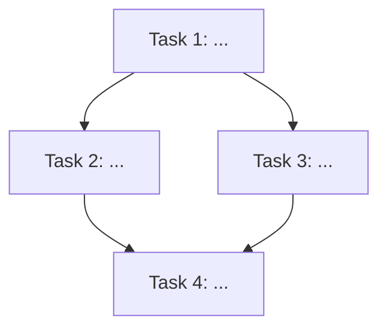

# Tasks: <change-title>

> **Purpose:** Implementation plan broken into checkable tasks. Written in Plan mode after design is approved. Must be approved via AskQuestion `tasks-review` popup before implementation.
>
> **plan_ref:** `.cursorplan/active/<slug>/plan.md`

## Task Sequence

---

### Task 1: <title>

- **Depends on:** none
- **Maps to:** AC-1, AC-2
- **Files:**
  - `path/to/file.ts` — (what changes)
- **Description:** (1-2 sentences describing the implementation work)

#### verify_steps

- [ ] `(test command)` — expected: (exit 0, output includes X)
- [ ] `(optional second command)`

---

### Task 2: <title>

- **Depends on:** Task 1
- **Maps to:** AC-3
- **Files:**
  - `path/to/file.ts` — (what changes)
- **Description:** (1-2 sentences)

#### verify_steps

- [ ] `(test command)` — expected: (criteria)

---

### Task N: <title>

- **Depends on:** Task N-1
- **Maps to:** AC-X
- **Files:**
  - `path/to/file.ts` — (what changes)
- **Description:** (1-2 sentences)

#### verify_steps

- [ ] `(test command)` — expected: (criteria)

---

## Verification Checklist (for feature-verify-review)

| AC ID | Met By Tasks |
|-------|-------------|
| AC-1 | Task 1 |
| AC-2 | Task 1 |
| AC-3 | Task 2 |

## Approval

- `tasks-review` AskQuestion: pending
